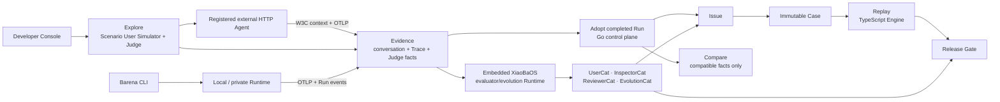

# Catena Platform Downstream

This repository is the Web and Trace subsystem for **Catena**, an Agent
continuous-evolution station. It is a downstream fork of
[LangWatch](https://github.com/langwatch/langwatch). Catena embeds
[Barena](https://github.com/fightheyyy/barena) as its Agent E2E evaluation and
release engine; Barena is not renamed or reimplemented here.

The locked MVP1 topology, evolution-job contract, trust boundaries, and ADRs
live in [docs/catena/architecture](./docs/catena/architecture/README.md).

## Product boundary

LangWatch remains the infrastructure substrate for:

- OpenTelemetry/OTLP ingestion;
- Trace storage, search, and waterfall views;
- projects, authentication, and API keys;
- registered HTTP Agent configuration;
- Scenario User Simulator, execution, trace-aware Judge, and live-run views.

Barena owns the Agent E2E and Release CI semantics:

- adoption of completed Platform Explore runs into canonical evidence;
- `replay`: fixed Cases for known-capability regression;
- `compare`: factual compatible-run comparison, with no implicit release verdict;
- Engine Inspector/Reviewer scorecards for local/private execution and
  verifier-backed `cleared / held / rejected` Release Check decisions;
- XiaoBaOS and other `AgentRuntimeAdapter` implementations;
- the embedded XiaoBaOS evaluator/evolution worker for UserCat, InspectorCat,
  ReviewerCat, and EvolutionCat;
- deterministic artifact verification and Replay Case promotion.

The target Agent Runtime always remains external. The embedded XiaoBaOS
Runtime is a separate, four-role evaluator/evolution worker; it is never the
user's target Agent. This Platform can execute
Explore against a registered reachable HTTP Agent through the existing
Scenario runtime. The Barena TypeScript Engine executes Replay and local/private
Explore next to the target Runtime. Both paths export telemetry here through
OTLP and correlate it with Run identity and W3C Trace Context.

The browser enters through this fork. Existing project authentication is
validated here; the Go service is an internal Release API and does not
duplicate GitHub login, project membership, or raw Trace storage. MVP1 uses a
loopback server-side proxy and Go's compatibility owner identity. Signed
project context and one fork-issued endpoint credential remain the production
target, not an MVP1 claim.

## Downstream policy

- Upstream remote: `https://github.com/langwatch/langwatch`.
- Community code outside `langwatch/ee/` is Apache-2.0 at the fork point.
- Enterprise-licensed modules under `langwatch/ee/` are not Barena-owned and
  must not be presented as Barena community features.
- Keep Barena changes small, isolated, and covered by focused tests so upstream
  releases can be merged regularly.
- Preserve LangWatch attribution, `LICENSE.md`, `NOTICE`, and all
  independently licensed SDK notices.

## MVP1 downstream slice

- Replace the shell wordmark and browser title with Barena.
- Localize the Barena shell and Evolution workflow in English and Simplified
  Chinese; follow the browser language initially and persist manual changes.
- Present Scenario simulations as the Barena **Explore** surface.
- Run registered HTTP Agents through the existing Scenario runtime; do not
  host the target Runtime or reimplement Scenario.
- Show and manage one embedded XiaoBaOS evaluator/evolution Runtime with a
  fixed four-role allowlist; do not present it as target hosting.
- Accept XiaoBaOS/Barena telemetry at `/api/otel/v1/traces` and verify one
  connected User Simulator → HTTP Agent → trace-aware Judge waterfall,
  including the target Runtime's W3C-parented child span.
- Add **Evolution** to the authenticated project navigation.
- Let a retained Trace create a prefilled Barena Issue.
- Review and promote exactly one immutable Case.
- Replay that Case through the existing TypeScript Engine Worker.
- Show canonical Evaluation and Release Gate records from Go; never infer or
  fake release state in the frontend.
- Compare compatible terminal Explore evidence side by side and label it as a
  non-decision; only Engine Release Check may emit a gate verdict.

## Verified MVP1

The current local acceptance completed Scenario Run
`scenariorun_0004MQPAovVIySBtXW4I213vhjPsW` against a deterministic
XiaoBaOS-compatible HTTP fixture. Trace
`929e40cd8045ac94e07f01e5febb233d` rendered:

- nine spans from Scenario User Simulator, registered HTTP Agent adapter,
  target XiaoBaOS Role, and trace-aware Judge;
- a real `SerializedHttpAgentAdapter.call -> xiaoba.role.turn` parent/child
  boundary, with the child exported by the target through OTLP;
- the terminal Scenario status and exact Judge verdict/criteria;
- the action that retains the run in Barena Evolution.

The browser adopted that terminal run as
`run-platform-702c474ef35f5275e22c803f`, created Issue
`issue-1785495217466-73113c9f751e2d62`, promoted immutable Case
`case-1785495239484-d0e46f2fda52f418`, and started Replay
`run-1785495248023-1f7787e7b5b24692`. Evaluation
`evaluation-run-1785495248023-1f7787e7b5b24692` and Release
`release-run-1785495248023-1f7787e7b5b24692` both retained source/replay Trace
lineage; the verifier-backed Release Gate was `cleared`. Three compatible
adopted Explore Runs also render in the read-only Compare view with exact facts
and no implicit release verdict.

For repeatability, Scenario User Simulator/Judge calls in this acceptance used
a deterministic local OpenAI-compatible model double. The recorded provider
and model names are fixture metadata, not evidence of a live hosted-model call.

MVP1 does not claim production tenancy, remote Runner scheduling, signed
project context, private-network access, or managed target Runtime execution.
See
[the local MVP1 guide](./langwatch/docs/barena-mvp1.md) for startup, correlation,
and verification.
