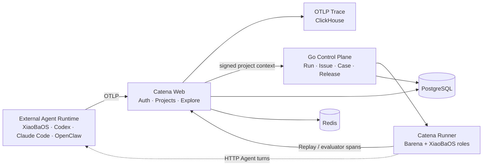

<p align="center">
  
</p>

<h1 align="center">Catena</h1>

<p align="center"><strong>以 Trace 为燃料的 Agent 持续进化平台</strong></p>

<p align="center">
  Observe real Agent behavior, discover failures, retain regression Cases, and
  verify the next release.
</p>

Catena connects deployed Agent Runtimes through OpenTelemetry/OTLP, gives
developers one place to inspect their real behavior, and turns concrete
failures into replayable release evidence. It embeds
[Barena](https://github.com/fightheyyy/barena) as its Agent E2E evaluation and
release engine and a restricted XiaoBaOS Runtime for evaluation/evolution
roles.

```text
Agent Trace → Explore → Issue → Regression Case → Replay → Release Gate
```

## What is included

| Surface | Capability |
| --- | --- |
| Observe | OTLP ingestion, Trace search/waterfall, coding-Agent sessions, and Agent Registry |
| Explore | Scenario-style simulated users, multi-turn HTTP Agent execution, and evidence-aware Judge |
| Evolve | InspectorCat → EvolutionCat → ReviewerCat proposals over retained Trace evidence |
| Replay | Immutable Regression Cases executed by the Barena verifier-backed engine |
| Release | Auditable Evaluation and `cleared / held / rejected` Release Gate records |
| Platform | GitHub login, projects, API keys, English/Chinese UI, PostgreSQL control records, and ClickHouse Trace storage |

Target Agents remain external. Catena does not need their framework internals:
any Runtime can send OTLP telemetry, while active Explore currently uses a
registered HTTP Agent endpoint. The embedded XiaoBaOS Runtime runs only the
four evaluator/evolution roles; it is not the user's target Agent.

## Architecture



The local MVP has three product services and three infrastructure services:

- `catena-app`: LangWatch-derived Web, authentication, Scenario, OTLP, and Trace subsystem;
- `catena-core`: Go workflow and durable evidence control plane;
- `catena-runner`: Barena execution plane and restricted XiaoBaOS roles;
- PostgreSQL, ClickHouse, and Redis.

See [SPEC.md](./SPEC.md) for ownership and trust boundaries.

## Quick start

Requirements: Docker Desktop with Compose and BuildKit.

```bash
git clone https://github.com/fightheyyy/CATENA.git
cd CATENA
./deploy/catena-mvp1/demo.sh up
```

Open <http://127.0.0.1:5570>. The first build downloads pinned Barena,
XiaoBaOS, and LangWatch runtime dependencies. The smoke test does not call a
paid model.

Optional configuration:

```bash
cp deploy/catena-mvp1/.env.example deploy/catena-mvp1/.env
```

Use `.env` for GitHub OAuth, production-grade secrets, custom ports, and the
XiaoBaOS evaluator model. Never commit it. Full instructions are in the
[six-container deployment guide](./deploy/catena-mvp1/README.md).

## Connect an Agent with OTLP

Create a project API key in Catena and configure any OpenTelemetry-compatible
Runtime:

```bash
export OTEL_SERVICE_NAME='my-agent'
export OTEL_TRACES_EXPORTER='otlp'
export OTEL_EXPORTER_OTLP_PROTOCOL='http/protobuf'
export OTEL_EXPORTER_OTLP_ENDPOINT='http://127.0.0.1:5570/api/otel'
export OTEL_EXPORTER_OTLP_HEADERS='Authorization=Bearer <CATENA_PROJECT_KEY>'
```

Catena also includes a Codex installer and a bounded historical backfill flow.
Live OTLP is near-real-time; completed spans normally appear within seconds.

## Product loop

1. Observe a real Session or run Explore against a reachable HTTP Agent.
2. Inspect its conversation, tool calls, artifacts, and OTLP Trace.
3. Retain a concrete failure as an Issue.
4. Let the XiaoBaOS evolution roles propose a Finding, Regression Case, and
   draft Role/Skill/Memory/Harness Candidate.
5. Review the proposal into an immutable Case.
6. Replay through Barena and inspect the Release Gate.

Evolution outputs remain proposals. Catena never silently edits a target
repository or publishes a Role/Skill without human review and Replay evidence.

## Repository boundary

- This repository owns the Catena Web/Trace subsystem, Go control plane,
  deployment, and platform integration.
- [fightheyyy/barena](https://github.com/fightheyyy/barena) owns the standalone
  TypeScript Explore/Replay/Compare engine, verifiers, Runtime adapters, CLI,
  and Release Check semantics.
- [LangWatch](https://github.com/langwatch/langwatch) remains the upstream for
  the OTLP, Trace, authentication, project, and Scenario substrate.

## Current maturity

MVP1 is suitable for local demonstration and development. The six-container
stack, GitHub login, API keys, OTLP ingestion, Agent Registry, Explore,
Trace-to-Case evolution, Replay, Compare, and Release Gate have automated and
browser acceptance coverage. Production cloud deployment, durable remote
Runner scheduling, backups, and broad active Runtime adapters remain future
work; see [PLAN.md](./PLAN.md).

## License and attribution

Catena is a downstream distribution of LangWatch. Community code follows the
Apache-2.0 boundary documented in [LICENSE.md](./LICENSE.md) and
[NOTICE](./NOTICE); independently licensed SDKs retain their original notices.
Enterprise-licensed upstream modules under `langwatch/ee/` are not presented
as Catena community features.
