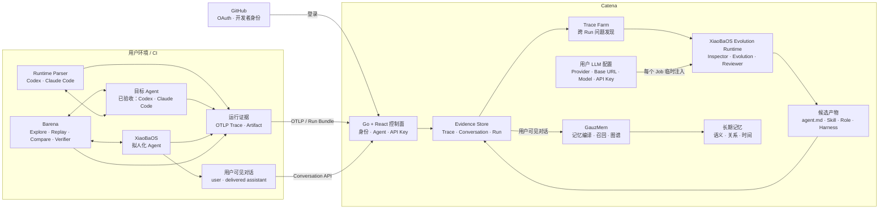

<p align="center">
  
</p>

<h1 align="center">Catena</h1>

<p align="center"><strong>以 Trace 为燃料的 Agent 持续进化平台</strong></p>

<p align="center">
  Observe what Agents actually did. Turn repeated evidence into better agent.md, Skills, Roles, and Harnesses.
</p>

Catena 汇聚 XiaoBaOS、Codex、Claude Code 和通用 OTLP Agent 的真实运行证据，从一段时间的 Trace 与对话中发现重复问题，生成可追溯、可人工采用的 Agent 进化候选。

```text
OTLP Trace ─┐
Conversation ├─→ Evidence ─→ XiaoBaOS Evolution Runtime ─→ Agent assets
Barena Run ──┘
```

## 核心能力

- **Agent**：把同一 Runtime 的多个 telemetry source 聚合为一个可理解的 Agent。
- **对话**：保存 XiaoBaOS 用户真正看到的消息，用于提炼记忆与角色知识。
- **记忆**：从对话生成可追溯记忆，并支持语义、关系与时间召回。
- **Trace**：按用户 Turn 阅读请求、模型调用、严格配对的 Tool、分支、状态与最终回答；原始 Span 瀑布保留为诊断视图。
- **Trace Farm**：按 Agent 与时间窗口分析多条 Trace，展示 Inspector、Evolution、Reviewer 三个阶段。
- **进化产物**：输出标准 `agent.md`、Skill、Role，以及 XiaoBaOS 专属 Harness 建议。

Catena 不托管或冒充用户的目标 Agent。平台内置的 XiaoBaOS Runtime 只消费 Evidence，不执行被测 Agent。Catena 也不提供公共 LLM；每位用户在 **API 管理** 中配置自己的 Provider、Base URL、Model 与 API Key。密钥加密保存，只在该用户的 Trace Farm 任务执行时临时解密。

## 产品边界



[Barena](https://github.com/fightheyyy/barena) 是端侧 Agent E2E 与发布 CI 引擎，负责 Explore、Replay、Compare 和确定性验证；Catena 负责长期证据、跨 Run 分析与进化候选。

## 架构

| 服务 | 职责 |
| --- | --- |
| `catena-core` | Go 控制面、React Web、GitHub OAuth、API Key、OTLP、Conversation 与产品 API |
| `catena-runner` | 内置 XiaoBaOS Evolution Runtime，不运行目标 Agent |
| `postgres` | 用户、Agent、Run、Job、Candidate 与审计事实 |
| `clickhouse` | Trace 与 Span 时序存储 |
| `caddy` | 公开部署的 HTTPS 与安全响应头 |

可选 `memory` profile 会增加 GauzMem、MySQL、Neo4j 与私有 Qdrant Server。

## 本地运行

要求 Docker Desktop、Docker Compose 与 BuildKit：

```bash
git clone https://github.com/fightheyyy/CATENA.git
cd CATENA
./deploy/catena-mvp1/demo.sh up
```

打开 <http://127.0.0.1:5570>。

```bash
./deploy/catena-mvp1/demo.sh smoke
./deploy/catena-mvp1/demo.sh logs
./deploy/catena-mvp1/demo.sh down
```

## 接入任意 OTel Agent

在 **API 管理 → 创建 Agent 密钥** 输入显示名称。Catena 会原子创建固定
`agent_id` 和绑定该 Agent 的接入密钥；用户不需要选择 Runtime：

```text
Agent connection key → agent_id → display name
```

创建后，接入面板会直接生成下面这段可复制配置，并自动等待第一条数据：

```bash
export CATENA_URL='http://127.0.0.1:5570'
export CATENA_API_KEY='catena_agent_...'
export OTEL_SERVICE_NAME='my-agent'
export OTEL_TRACES_EXPORTER='otlp'
export OTEL_EXPORTER_OTLP_PROTOCOL='http/protobuf'
export OTEL_EXPORTER_OTLP_TRACES_ENDPOINT="${CATENA_URL}/v1/otlp/v1/traces"
export OTEL_EXPORTER_OTLP_HEADERS="Authorization=Bearer ${CATENA_API_KEY}"
```

Catena 会从证据自动识别 XiaoBaOS、Codex、Claude Code；无法识别时显示为
通用 OTel Agent。客户端提交的 Agent 身份不能覆盖密钥绑定。普通 OTLP Trace
足以进行观测与跨 Run 分析；Barena Run Bundle 可补充 Artifact、Verifier 与发布结论。

### 捕获完整的 Agent Turn

部分 Runtime 的原生 OTLP 只导出一条顶层 Span，无法还原中间的模型请求、
Tool Call 和 Tool Result。Catena 复用固定版本的 Langfuse 开源 Codex/Claude
Parser 与 Turn assembly，在本地将 rollout/transcript 转换为统一 Event Graph，
再由 Catena 自己的 OTLP exporter 上传：

```bash
cd tap
python3.12 -m pip install -e .
cd codex && pnpm install --frozen-lockfile && pnpm build

export CATENA_URL="https://your-catena.example"
export CATENA_API_KEY="catena_agent_..."

catena trace import codex /path/to/rollout.jsonl
catena trace import claude /path/to/transcript.jsonl
```

Live 采集由随仓库提交的 Codex `Stop` 与 Claude Code `Stop/SessionEnd` Hook
完成；live 和 historical import 调用同一套 Parser。Hook 增量、可恢复且
fail-open，重复触发复用确定性 Span ID。两者都以 Runtime 原生 Session/Turn
相关键生成 OTLP Trace ID，不建立 Capture Session，也不比较 Prompt 文本；
Codex Stop 后的有界 settle pass 会用相同 Parser 合并稍后落盘的
`task_complete`。当前只对 Codex CLI `0.147.0` 与
Claude Code `2.1.112` 完成真实验收；Codex App、Hermes、OpenClaw 没有独立
Parser，因此不声明支持。详细说明见 [Runtime Capture](./tap/README.md)。

这里的实时是“每个 Turn 停止后立即增量同步”，不是逐 Token 流式同步。
Codex 的模型与 Tool 事件会在该 Turn 的 `Stop` Hook 触发后进入 Catena；若
进程在 Hook 前异常退出，则由下一次 Hook 或 historical import 按相同稳定 ID
恢复。

## 接入 XiaoBaOS 对话

XiaoBaOS 使用同一个 Agent 接入密钥增量同步用户可见的 Conversation Journal：

```bash
export CATENA_BASE_URL="${CATENA_URL}"
export CATENA_API_KEY="${CATENA_API_KEY}"
export XIAOBA_CONVERSATION_AGENT_ID='my-xiaoba'
xiaoba chat
```

Conversation 是记忆与角色知识的燃料；Trace 是 Tool、Runtime 与 Harness 分析的燃料。

### 为什么 XiaoBaOS 单独同步用户可见对话

XiaoBaOS 走的是“拟人化工作同事”路线：用户关心的不只是一次任务是否完成，还包括它是否记得长期偏好、人物关系、共同经历和沟通习惯。因此，形成记忆的事实源应该是用户真正参与并看到的对话——用户发出的消息，以及已经成功送达的 Agent 文本或文件回复。

系统 Prompt、隐藏推理、Tool 调用和失败重试仍然进入 Trace，用来诊断 Runtime 与 Harness；它们不应被当成用户经历直接写入长期记忆。Catena 因而保留两条独立的数据路径：

```text
OTLP Trace          → Trace Farm → agent.md / Skill / Role / Harness
XiaoBaOS Conversation → GauzMem   → semantic / graph / temporal memory
```

MVP1 先为 XiaoBaOS 提供第一方 Conversation 协议，因为它具备稳定的用户可见消息日志；其他 Agent 若能提供同等语义的对话事件，后续也可以通过 Conversation Adapter 接入。

## 公开单机 Beta

```bash
cp deploy/catena-mvp1/.env.public.example deploy/catena-mvp1/.env
# 配置域名、GitHub OAuth 与随机密钥
./deploy/catena-mvp1/public.sh config
./deploy/catena-mvp1/public.sh up
```

公开模式只暴露 Caddy 的 80/443；控制面、数据库和 Runtime 留在私有 Docker 网络。详见 [部署文档](./deploy/catena-mvp1/README.md)。

## 状态与开发

MVP1 已覆盖 GitHub 登录、Agent 注册与专属接入密钥、用户自带 LLM、OTLP 导入、Runtime 自动识别、Agent 聚合、Span 瀑布、XiaoBaOS Conversation、Trace Farm、进化候选与中英文 UI。当前定位是 single-node Beta；多 Worker lease、备份恢复、配额与完整 RBAC 尚未完成。

```bash
cd catena-web && pnpm install --frozen-lockfile --ignore-workspace && pnpm test && pnpm typecheck && pnpm build
cd ../control-plane && go test ./... && go vet ./... && go test -race ./internal/control
cd ../tap && python3.12 -m pip install -e '.[dev]' && pytest
cd codex && pnpm install --frozen-lockfile && pnpm typecheck && pnpm test && pnpm build
docker compose -f deploy/catena-mvp1/compose.yml config >/dev/null
```

架构契约见 [SPEC.md](./SPEC.md)，剩余工作见 [PLAN.md](./PLAN.md)，演示证据见 [MVP1 验收记录](./docs/acceptance/CATENA_MVP1_DEMO.md)。

## License

Apache License 2.0。第三方归属见 [NOTICE](./NOTICE)。
