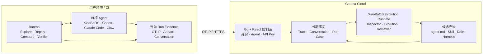

<p align="center">
  
</p>

<h1 align="center">Catena</h1>

<p align="center"><strong>以 Trace 为燃料的 Agent 持续进化平台</strong></p>

<p align="center">
  Observe what Agents actually did. Turn repeated evidence into better agent.md, Skills, Roles, and Harnesses.
</p>

Catena 把分散在 XiaoBaOS、Codex、Claude Code 和各类 Claw 中的运行证据汇聚到一个地方：
先看清 Agent 的真实行为，再从一段时间的 Trace 与对话中发现重复问题，最后生成可追溯、可人工采用的进化候选。

```text
OTLP Trace ─┐
Conversation ├─→ Catena Evidence ─→ XiaoBaOS Evolution Runtime ─→ Agent assets
Barena Run ──┘
```

## 它解决什么

- **Agent**：按 Runtime 与实例查看正在运行的 Agent，而不是面对一堆 service name。
- **对话**：保存 XiaoBaOS 用户真正看到的消息，用于提炼记忆、Prompt 与角色知识。
- **Trace**：用极简瀑布查看模型、Tool、Artifact 和错误；Runtime 内部噪声默认折叠。
- **Trace Farm**：按 Agent 和时间窗口分析一组 Trace，依次展示 InspectorCat、EvolutionCat、ReviewerCat 的工作证据。
- **进化产物**：输出标准 `agent.md`、Skill、Role，以及仅面向 XiaoBaOS 的 Harness 优化建议。
- **记忆**：由对话提炼、通过语义 / 关系 / 时间三条路径召回；GauzMem 只负责记忆管理与供应。

Catena 不托管、也不冒充用户的目标 Agent。平台内置的 XiaoBaOS 是“证据消费 Runtime”，只分析已上传的 Evidence，不执行被测 Agent。

## 边界



[Barena](https://github.com/fightheyyy/barena) 是端侧 Agent E2E 与发布 CI 引擎，负责 Explore、Replay、Compare 和确定性验证；Catena 是云端长期证据与进化平台。两者可以一起使用，也可以单独接入。

## 架构

默认部署只有五个服务：

| 服务 | 职责 |
| --- | --- |
| `caddy` | HTTPS、证书与安全响应头（公开部署） |
| `catena-core` | Go 控制面、React Web、GitHub OAuth、API Key、OTLP/Conversation API |
| `catena-runner` | 内置 XiaoBaOS Evolution Runtime，不运行目标 Agent |
| `postgres` | 用户、Agent、Run、Job、Candidate 与审计事实 |
| `clickhouse` | Trace 与 Span 时序存储 |

可选 `memory` profile 增加 GauzMem、MySQL 与 Neo4j。保留的 LangWatch 源码仅作为迁移与许可证边界，不在默认产品路径中运行。

## 本地运行

要求 Docker Desktop、Docker Compose 与 BuildKit：

```bash
git clone https://github.com/fightheyyy/CATENA.git
cd CATENA
./deploy/catena-mvp1/demo.sh up
```

打开 <http://127.0.0.1:5570>。默认模式只绑定 loopback，适合本地开发和验收。

```bash
./deploy/catena-mvp1/demo.sh smoke
./deploy/catena-mvp1/demo.sh logs
./deploy/catena-mvp1/demo.sh down
```

## 接入任意 OTel Agent

在 Catena 设置页创建个人 API Key，然后配置 OTLP/HTTP exporter：

```bash
export CATENA_URL='http://127.0.0.1:5570'
export CATENA_API_KEY='barena_pat_...'
export OTEL_SERVICE_NAME='my-agent'
export OTEL_TRACES_EXPORTER='otlp'
export OTEL_EXPORTER_OTLP_PROTOCOL='http/protobuf'
export OTEL_EXPORTER_OTLP_TRACES_ENDPOINT="${CATENA_URL}/v1/otlp/v1/traces"
export OTEL_EXPORTER_OTLP_HEADERS="Authorization=Bearer ${CATENA_API_KEY}"
```

普通 OTLP Trace 已足够进行跨 Run 分析。Barena Run Bundle 会再补充 evaluator、Artifact、Verifier 与发布结论。

## 接入 XiaoBaOS 对话

对话不是 Trace。XiaoBaOS 会把用户消息与成功送达的文本 / 文件回复记录到本地 Conversation Journal，并使用同一 API Key 增量同步：

```bash
export CATENA_BASE_URL="${CATENA_URL}"
export CATENA_API_KEY="${CATENA_API_KEY}"
export XIAOBA_CONVERSATION_AGENT_ID='my-xiaoba'
xiaoba chat
```

对话用于 Memory、`agent.md`、Skill 与 Role；Trace 用于 Tool、Runtime 与 Harness 行为分析。

## 公开单机 Beta

Catena 提供一个明确标注为 **single-node Beta** 的 HTTPS 部署，不声称多机高可用：

```bash
cp deploy/catena-mvp1/.env.public.example deploy/catena-mvp1/.env
# 配置域名、GitHub OAuth、独立随机密钥与模型 Provider
./deploy/catena-mvp1/public.sh config
./deploy/catena-mvp1/public.sh up
```

公开模式会强制 GitHub OAuth、HTTPS callback、非默认数据库密码和 24 字符以上随机密钥；只有 Caddy 暴露 80/443，数据库与 Runtime 均留在私有 Docker 网络。详细说明见 [部署文档](./deploy/catena-mvp1/README.md)。

## 当前成熟度

MVP1 已覆盖 GitHub 登录、个人 API Key、OTLP 导入、Agent 聚合、Span 瀑布、XiaoBaOS Conversation、Trace Farm、四类候选产物，以及中英文 Web UI。

当前公开部署是演示 / 早期 Beta：数据可持久化，但仍是单节点；主机故障时正在执行的角色 Turn 不会自动续租恢复。面向正式多租户收费前还需要 durable worker lease、备份恢复演练、配额与更完整的权限模型。

## 开发与验证

```bash
cd catena-web && pnpm install --frozen-lockfile && pnpm test && pnpm typecheck && pnpm build
cd ../control-plane && go test ./... && go vet ./...
docker compose -f deploy/catena-mvp1/compose.yml config >/dev/null
```

架构契约见 [SPEC.md](./SPEC.md)，已验证状态与剩余工作见 [PLAN.md](./PLAN.md)，真实 XiaoBaOS Trace → Candidate 演示见 [MVP1 验收记录](./docs/acceptance/CATENA_MVP1_DEMO.md)。

## License

Catena 包含 Apache-2.0 LangWatch-derived 迁移代码。许可证边界记录在 [LICENSE.md](./LICENSE.md) 与 [NOTICE](./NOTICE)；未把上游企业版能力表述为 Catena 社区功能。
