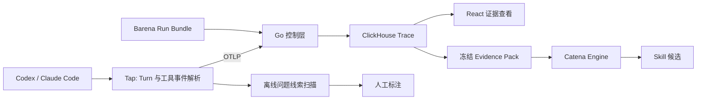

<p align="center">
  
</p>

<h1 align="center">Catena</h1>

<p align="center"><strong>从编程 Agent 的真实运行中，找到可修复的问题。</strong></p>

<p align="center">
  Traceable failure patterns and reviewable Skill drafts from Codex and Claude Code sessions.
</p>

Catena 收集 Codex 和 Claude Code 的运行证据，按 Turn 回看工具调用，帮助维护者找出值得核对的重复问题并生成 Skill 候选。主界面围绕工作台、经历、产出、记忆和 Case 实验展开。Catena Agent 帮助用户分析和规划，Harbor 执行目标 Agent 的评测。候选仍需独立回归验证，Reviewer 的通过不代表目标 Agent 已改善。

当前支持 Codex、Claude Code 的本地采集插件，以及通用 OTLP Trace 接收；可读取的信息取决于来源实际导出的内容。Agent 不原生输出 OTLP 时，需要采集插件或适配器。离线失败线索扫描、人工标注表和独立的 Skill 配对实验入口已可复跑，尚未接入问题卡 UI。首个 3 题合成试跑为基线 3/3、候选 3/3，尚无真实失败修复率结果。

2026-10-03 已从 5 个真实会话确认缺失 `rg` 的重复工具错误，并冻结
[PowerShell 搜索 Case](evals/rg-missing-search/CASE.md)。确定性环境重放已通过；
Codex CLI 对照未通过环境验收，旧 3/3 试跑不能作为效果证据。随后通过
本地 CLIProxyAPI 的 GPT-5.5 完成 12 次有效 SDK 对照：两组均 6/6 答对，
Skill 将缺失 rg 错误调用从 4 次降到 0 次，但输入令牌增加 29.4%，未证明
成功率或效率提升。[实验结论](docs/CASE_RG_MISSING_20261003.md)。
平台运行时采用 OpenAI Agents SDK；随后完成
[平台 Agent 调用 Harbor 的 Docker 实验](docs/HARBOR_EXPERIMENT_20261003.md)，
6 次有效 Trial，两组均 3/3，缺失 rg 错误调用 2→0。
现已提供 [Case 实验页面](docs/HARBOR_WEB_EXPERIMENTS.md)，支持发起、查看与恢复实验。
E2B 接入仍未完成云端验收；本地评测使用 Docker。

## 冻结实验：7 Skills / 28 Tasks / 168 Rollouts

从 3,021 条真实 Trace 的操作故障线索归纳 7 项手工编写的 Skill，构造
28 个匿名重构及变体任务，通过 Harbor 0.23.0 驱动真实 Codex CLI 完成
168 次有效对照实验。without / with 通过率为 **77/84（91.7%）与
80/84（95.2%）**，增加 3.57 个百分点；工具调用从 **660 增至 796**，
总 token 增加 9.1%。结果不支持总体成本下降或广泛有效的结论。

- [完整结果、指标与限制](evals/trace-skill-benchmark/results/ab-v2.md)
- [任务集、Skill 与复跑方法](evals/trace-skill-benchmark/README.md)
- [冻结报告](evals/trace-skill-benchmark/releases/catena-harbor-trace-skills-v1.0.0/RESULTS.zh-CN.md)
- [冻结数据集与结果 ZIP](evals/trace-skill-benchmark/releases/catena-harbor-trace-skills-v1.0.0.zip)

这些任务不是严格的历史 held-out 集。原始私人会话、模型密钥和运行日志保留在
Git 忽略的 `.local/` 中，公开包包含任务、汇总指标、验证证据和复现说明。

```text
Codex / Claude Code 会话 → Tap → Trace → 可审查的问题线索
                                  └→ Catena Engine → Skill 候选
Skill 候选 + 冻结案例 → 本地配对实验入口 → 独立 verifier 与指标
```

## 核心能力

- **总览**：打开即见最近经历与产出；支持搜索、Agent 筛选及准确回到来源，局部加载失败可以单独重试。
- **主动助手**：输入关注目标、查看近期线索并发起分析；当前仅在页面打开时检查新 Trace，[能力边界与后续技术路线](docs/PROACTIVE_ASSISTANT.md)。
- **经历**：按 Turn 阅读请求、调用与最终回答，详细 Span 与原始字段按需展开。
- **失败线索研究**：离线扫描真实会话，输出保留分母的信号分组与固定抽样标注表；[方法和当前覆盖](docs/FAILURE_STUDY.md)。
- **产出**：阅读、复制或下载 `agent.md`、Skill、Role 和 DSH Plugin 候选包；保留来源 Trace、分析过程与审查信息。
- **连接**：为每个 Agent 创建独立凭证，复制 POSIX/PowerShell 配置，检测第一条数据；在这里配置自己的分析模型。

平台内置的 Catena Engine 消费 Evidence 并生成候选方法；目标 Agent 的执行与验证留在端侧。每位用户在 **连接** 中配置自己的 Provider、Base URL、Model 与 API Key。密钥加密保存，只在该用户的分析任务执行时临时解密。

旧 XiaoBaOS 对话数据仍可从原有深链接读取；`POST /v1/ingest/conversations` 已停止接入新数据。新的 Agent 证据统一通过 OTLP Trace 上传。

## 产品边界


```mermaid
flowchart LR
    Agent["Codex / Claude Code"] --> Tap["Tap: Turn 与工具事件解析"]
    Tap -->|"OTLP"| Core["Go 控制层"]
    Core --> CH["ClickHouse Trace"]
    CH --> UI["React 证据查看"]
    Tap --> Scan["离线问题线索扫描"] --> Labels["人工标注"]
    CH --> Pack["冻结 Evidence Pack"] --> Engine["Catena Engine"] --> Draft["Skill 候选"]
    Barena["Barena Run Bundle"] --> Core
```

[Barena](https://github.com/fightheyyy/barena) 是端侧 Agent E2E 与发布 CI 引擎，负责 Explore、Replay、Compare 和确定性验证；Catena 负责长期证据、跨 Run 分析与进化候选。

## 架构

| 服务 | 职责 |
| --- | --- |
| `catena-core` | Go 控制面、React Web、GitHub OAuth、API Key、OTLP Trace 与产品 API |
| `catena-engine` | 使用用户配置的模型运行 Inspector、Evolution、Reviewer；不运行目标 Agent |
| `catena-runner` | 保留现有 Barena Run 接入能力 |
| `postgres` | 用户、Agent、Run、Job、Candidate 与审计事实 |
| `clickhouse` | Trace 与 Span 时序存储 |
| `caddy` | 公开部署的 HTTPS 与安全响应头 |

可选 `memory` profile 会增加 GauzMem、MySQL、Neo4j 与私有 Qdrant Server。

## 本地运行

要求 Docker Desktop、Docker Compose 与 BuildKit：

```bash
git clone https://github.com/fightheyyy/CATENA.git
cd CATENA
./deploy/catena-mvp1/demo.sh up
```

打开 <http://127.0.0.1:5570>。

```bash
./deploy/catena-mvp1/demo.sh smoke
./deploy/catena-mvp1/demo.sh logs
./deploy/catena-mvp1/demo.sh down
```

## 接入任意 OTel Agent

在 **API 管理 → 创建 Agent 密钥** 输入显示名称。Catena 会原子创建固定
`agent_id` 和绑定该 Agent 的接入密钥；用户不需要选择 Runtime：

```text
Agent connection key → agent_id → display name
```

创建后，接入面板会直接生成下面这段可复制配置，并自动等待第一条数据：

面板支持 macOS/Linux shell 和 Windows PowerShell。预览中的密钥是占位符，
点击“复制完整配置”时才会填入真实密钥。执行配置后，需要重启支持 OTLP 的
Agent 并实际运行一次任务；复制本身不会上传数据。检测失败或两分钟未收到
数据时，可以修正配置后重新检测，收到数据后可直接进入该 Agent。

```bash
export CATENA_URL='http://127.0.0.1:5570'
export CATENA_API_KEY='catena_agent_...'
export OTEL_SERVICE_NAME='my-agent'
export OTEL_TRACES_EXPORTER='otlp'
export OTEL_EXPORTER_OTLP_PROTOCOL='http/protobuf'
export OTEL_EXPORTER_OTLP_TRACES_ENDPOINT="${CATENA_URL}/v1/otlp/v1/traces"
export OTEL_EXPORTER_OTLP_HEADERS="Authorization=Bearer ${CATENA_API_KEY}"
```

Catena 会从证据自动识别 XiaoBaOS、Codex、Claude Code；无法识别时显示为
通用 OTel Agent。客户端提交的 Agent 身份不能覆盖密钥绑定。普通 OTLP Trace
足以进行观测与跨 Run 分析；Barena Run Bundle 可补充 Artifact、Verifier 与发布结论。

### 捕获完整的 Agent Turn

部分 Runtime 的原生 OTLP 只导出一条顶层 Span，无法还原中间的模型请求、
Tool Call 和 Tool Result。Catena 复用固定版本的 Langfuse 开源 Codex/Claude
Parser 与 Turn assembly，在本地将 rollout/transcript 转换为统一 Event Graph，
再由 Catena 自己的 OTLP exporter 上传：

```bash
cd tap
python3.12 -m pip install -e .
cd codex && pnpm install --frozen-lockfile && pnpm build

export CATENA_URL="https://your-catena.example"
export CATENA_API_KEY="catena_agent_..."

catena trace import codex /path/to/rollout.jsonl
catena trace import claude /path/to/transcript.jsonl
```

Live 采集由随仓库提交的 Codex `Stop` 与 Claude Code `Stop/SessionEnd` Hook
完成；live 和 historical import 调用同一套 Parser。Hook 增量、可恢复且
fail-open，重复触发复用确定性 Span ID。两者都以 Runtime 原生 Session/Turn
相关键生成 OTLP Trace ID，不建立 Capture Session，也不比较 Prompt 文本；
Codex Stop 后的有界 settle pass 会用相同 Parser 合并稍后落盘的
`task_complete`。当前只对 Codex CLI `0.147.0` 与
Claude Code `2.1.112` 完成真实验收；Codex App、Hermes、OpenClaw 没有独立
Parser，因此不声明支持。详细说明见 [Runtime Capture](./tap/README.md)。

这里的实时是“每个 Turn 停止后立即增量同步”，不是逐 Token 流式同步。
Codex 的模型与 Tool 事件会在该 Turn 的 `Stop` Hook 触发后进入 Catena；若
进程在 Hook 前异常退出，则由下一次 Hook 或 historical import 按相同稳定 ID
恢复。

## 公开单机 Beta

```bash
cp deploy/catena-mvp1/.env.public.example deploy/catena-mvp1/.env
# 配置域名、GitHub OAuth 与随机密钥
./deploy/catena-mvp1/public.sh config
./deploy/catena-mvp1/public.sh up
```

公开模式只暴露 Caddy 的 80/443；控制面、数据库和 Runtime 留在私有 Docker 网络。详见 [部署文档](./deploy/catena-mvp1/README.md)。

## 状态与开发

本地优化优先于再次上线。登录后的默认入口是 Agent；各页面按需读取数据，
Trace 链接保留精确记录，Trace Farm 的任务完成状态会同步到资产库。
这些界面行为有独立的浏览器回归测试；模拟数据测试不代替真实接入、模型执行
或生成产物的效果验收。

MVP1 已覆盖 GitHub 登录、Agent 注册与专属接入密钥、用户自带 LLM、OTLP 导入、Runtime 自动识别、Agent 聚合、Span 瀑布、进化候选与中英文 UI。DeepSeek Harness 已打通 DSH → Barena Explore → Catena Trace Farm → DSH Plugin 产出与本地安装验收。当前定位是 single-node Beta；多 Worker lease、备份恢复、配额与完整 RBAC 尚未完成。

```bash
cd catena-web && pnpm install --frozen-lockfile --ignore-workspace && pnpm test && pnpm typecheck && pnpm build
pnpm exec playwright install chromium && pnpm test:browser
cd ../control-plane && go test ./... && go vet ./... && go test -race ./internal/control
cd ../tap && python3.12 -m pip install -e '.[dev]' && pytest
cd codex && pnpm install --frozen-lockfile && pnpm typecheck && pnpm test && pnpm build
docker compose -f deploy/catena-mvp1/compose.yml config >/dev/null
```

架构契约见 [SPEC.md](./SPEC.md)，剩余工作见 [PLAN.md](./PLAN.md)。求职展示材料：[失败线索研究](./docs/FAILURE_STUDY.md)、[竞品对照](./docs/COMPETITOR_COMPARISON.md)、[技术博客草稿](./docs/showcase/CODING_AGENT_TRACE_BLOG.md)、[3 分钟演示脚本](./docs/showcase/THREE_MINUTE_DEMO.md)。旧功能见 [XiaoBaOS 对话记忆兼容说明](./docs/XIAOBA_MEMORY_LEGACY.md)。

## License

Apache License 2.0。第三方归属见 [NOTICE](./NOTICE)。
## OpenViking 记忆接入

平台可通过 OpenViking 保存和检索个人记忆。记忆页支持手动添加、中文检索、文件关系查看；Trace 详情可发起异步提炼。平台分析会召回相关记忆，保留参考上下文快照。

本地 embedding 使用 CPU 上的 BGE-small-zh，无需 embedding API Key。记忆提炼复用配置的模型服务。部署、隔离边界和实测结果见 [接入说明](docs/OPENVIKING_INTEGRATION.md)。团队共享空间尚未实现。

2026-10-04 完成 [历史记忆 / Skill 的 Harbor 三组对照](docs/MEMORY_SKILL_EXPERIMENT_20261004.md)：18 次有效 Trial，三组答案均 6/6，缺失 rg 错误为 4 / 3 / 0。Skill 总 token 增加约 15.2%，没有成功率或耗时改善。实验页可查看来源 Trace、冻结记忆及逐次工具日志。
