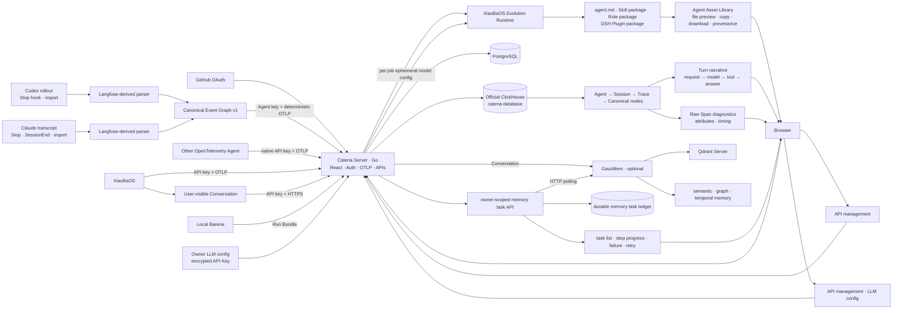
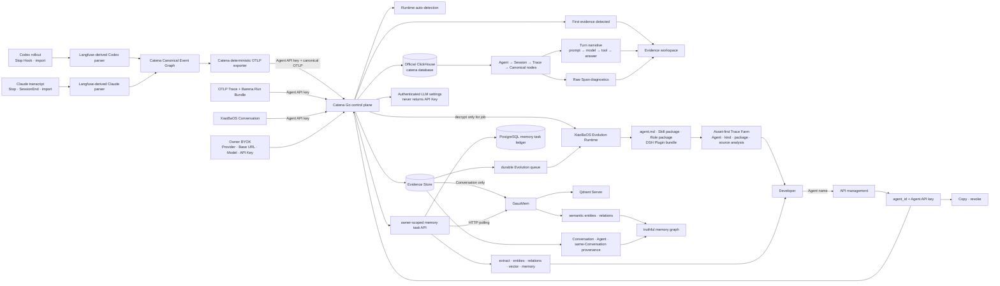

# Catena Product Specification

Status: MVP1 architecture contract
Updated: 2026-08-14

## Problem

Agent behavior changes when its model, Prompt, Role, Skill, Tool, memory or Runtime changes. Catena retains real execution evidence and converts repeated behavior into reviewable Agent assets instead of relying on isolated demos or subjective impressions.

## Scope

Catena owns:

- GitHub OAuth, sessions, first-class Agent identity and Agent-bound API keys;
- OTLP ingestion, Trace indexing and Span query;
- XiaoBaOS user-visible Conversation ingestion;
- canonical Agent grouping and Agent-scoped Trace windows;
- durable Run, Evidence, Evolution Job and Candidate records;
- an embedded XiaoBaOS Evolution Runtime that produces evidence-linked `agent.md`, Skill packages, Role packages and Runtime-bound DSH Plugin packages;
- an owner-scoped gateway to the optional GauzMem memory service.

Catena also ships local Codex and Claude Code Runtime plugins. They parse the
authoritative rollout/transcript files into one Canonical Event Graph and
export deterministic Agent Turn OTLP without proxying model traffic.

Catena does not host the target Agent, execute Explore/Replay/Compare, automatically edit a target repository, or claim that a model review is a release decision. Those execution and verification responsibilities remain in local Barena.

## Current Architecture

React calls only same-origin Go APIs. Go is the sole public backend. The Runner and databases are private services.

XiaoBaOS follows an anthropomorphic coworker model, so its durable memory is grounded in messages the user actually saw: user input and successfully delivered assistant text/files. Hidden prompts, reasoning, tool calls and failed deliveries remain Trace evidence and never become user-experience facts by default.

## Target Architecture

The target makes Agent identity explicit before any data arrives. The API key,
not payload-supplied names or Runtime selection, determines ownership. Runtime
is inferred from accepted Conversation or OTLP evidence and remains display
metadata. Existing unbound personal keys are ingestion-compatible during
migration but are no longer a product creation path.

API management owns Agent credential creation, clipboard-only recovery and
revocation. Plaintext credentials are never rendered as a second UI object.
Agent pages only present observed evidence and evidence-dependent actions.
Internal IDs and source aliases remain secondary details.

Catena does not provide a shared Evolution model. Every owner configures a
Provider, Base URL, Model and API Key in API management. The credential is
encrypted at rest, decrypted only while dispatching that owner's Evolution
Job, and never returned to the browser. Language and theme are personal Web
preferences and live only in Settings.

## Core contracts

- **Registered Agent:** stable owner-scoped `agent_id`, user-chosen display name,
  inferred Runtime and connection timestamps.
- **Agent API key:** one recoverable/revocable credential bound to exactly one
  Registered Agent; it determines Agent identity for every upload.
- **Local workspace:** the loopback Compose deployment keeps the same
  Agent-name → bound-key → OTLP contract without requiring GitHub OAuth.
  Public deployments continue to require OAuth for human control-plane access.
- **Owner LLM config:** one encrypted owner-scoped Provider/Base URL/Model/API
  Key tuple used only for that owner's Evolution Jobs.
- **Evidence hierarchy:** Agent is the stable deployment identity; Session is
  the Runtime-provided conversation/task identity; Trace is one end-to-end
  Agent turn or request; Span is one model, tool or internal operation. Missing
  Session metadata is presented as ungrouped evidence and never inferred from
  timing alone. Session display titles are deterministic UI projections of the
  earliest retained user request; the exported Session ID remains authoritative.
- **Coding Agent capture:** only Codex CLI and Claude Code are supported. Their
  live hooks and historical import share the same pinned Langfuse-derived
  Runtime parsers. Codex App, Hermes and OpenClaw remain unsupported until they
  have independent parsers and real acceptance.
- **Local Runtime credential:** the Codex plugin reads an environment override
  or its Codex-provided private plugin-data file. The Agent key is never stored
  in the repository, plugin bundle or Codex configuration; permissive key-file
  modes are rejected.
- **Canonical Event Graph:** a versioned local contract preserving Runtime
  session/turn/trace/call correlation, source-event accounting, model attempts,
  strict tool-result pairing, abort/retry/incomplete state, compaction and
  subagent parentage before deterministic OTLP rendering.
- **Trace:** OTLP/HTTP protobuf or JSON authenticated by Agent API key. Trace
  summaries expose their authenticated Agent and the first supported Session
  identity found in retained Span attributes.
- **Barena observation:** a correlated evaluation Trace is presented as
  Run → Turn → Model/Tool → Check. Wrapper spans remain queryable as raw
  evidence but do not compete with user-visible turns or verifier conclusions.
- **Trace store:** Catena-owned `catena_spans` in the `catena` database on the
  pinned official ClickHouse image. Product code, configuration and runtime do
  not depend on retired platform images, schemas or attribute aliases.
- **Conversation:** `xiaoba.conversation_batch.v1`, append-only XiaoBaOS
  user-visible messages whose Agent identity is overwritten from the key.
- **Memory source:** user-visible Conversation only; Trace is engineering and evolution evidence.
- **Memory task:** owner-scoped asynchronous GauzMem task exposed through
  Catena as a durable, listable task record plus bounded polling state. Task
  transport is HTTP; Redis is not a browser transport or the source of product
  truth.
- **Memory graph:** semantic relations come from GauzMem. Catena may add only
  provenance-backed structural context (source Conversation, Agent and
  same-Conversation adjacency); it never fabricates a semantic relation merely
  to populate the UI.
- **Agent Trace Set:** immutable Agent + time-window snapshot containing at least two server-frozen Trace IDs.
- **Evolution Job:** Inspector → Evolution → Reviewer analysis over one Agent Trace Set. Its owner may delete a completed or failed analysis and its generated assets; the immutable source Trace evidence remains intact.
- **Asset lifecycle:** deleting from either the Asset Library or Analysis view
  removes the terminal Evolution Job and its generated asset together; source
  Trace evidence remains intact.
- **Agent Asset:** exactly one of `agent.md`, a Skill package (`SKILL.md` plus
  optional support files), a XiaoBaOS Role package (`role.json`, prompt and
  optional role-local Skills), or a DeepSeek Harness Plugin bundle. A DSH
  Plugin is emitted only for evidence identified as `dsh`; it is rooted at
  `dsh-plugins/<name>` and contains a non-executable `package.json` plus
  `cordis.patch.yml` that Barena can install into a run-private DSH Profile.
- **Asset language:** every Trace Farm Job persists `output_language`. Inspector,
  Evolution and Reviewer use that same language for all human-readable output;
  protocol keys, paths, commands and code identifiers remain unchanged.
- **Run Bundle:** idempotent Barena terminal facts plus correlated OTLP evidence.
- **Release truth:** only verifier-backed Barena output may say `cleared`, `held` or `rejected`.

## Security invariants

- Cross-owner reads and writes fail closed.
- Personal API keys are hash-authenticated; owner-only recovery uses an encrypted envelope.
- An Agent API key cannot upload evidence as another Agent, even when the
  payload contains a different `agent_id` or `service.name`.
- OAuth state and PKCE validation fail closed.
- Target credentials and arbitrary request templates are not persisted.
- Evolution model credentials are encrypted at rest, never rendered after
  creation and never projected into Job records, logs or Candidate assets.
- Coding Runtime Agent keys are not embedded in Hook commands or
  `~/.codex/config.toml`.
- GauzMem is private and receives an owner scope derived by Catena.
- Evolution output is always a proposal and never mutates a target Agent automatically.
- Queued and running Evolution Jobs cannot be deleted; terminal deletion is owner-scoped and never cascades to source Trace or Conversation evidence.

## Modules

- [Go control plane](./control-plane/SPEC.md)
- [React Web](./catena-web/SPEC.md)
- [Catena Tap](./tap/SPEC.md)
- [Deployment](./deploy/catena-mvp1/README.md)
- [Barena engine](https://github.com/fightheyyy/barena)
