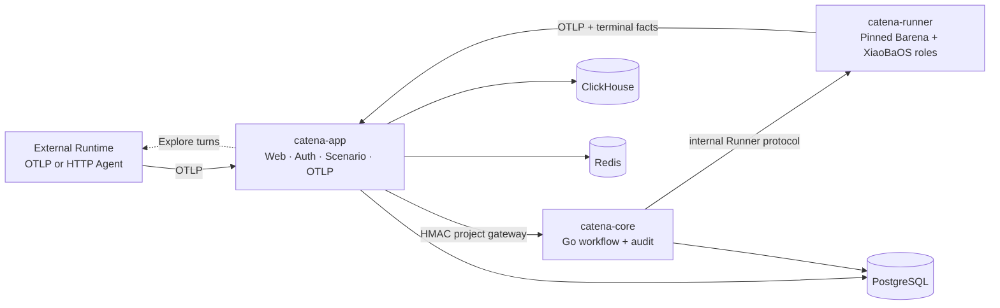
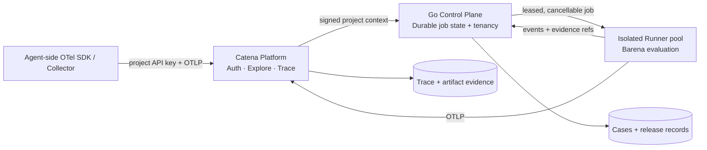

# Catena Product Specification

Status: MVP1 architecture contract
Updated: 2026-08-03

## Problem

Agent behavior changes when a model, Prompt, Role, Skill, Tool, memory,
permission, orchestration rule, or Runtime changes. Conventional unit tests do
not show whether a deployed Agent still completes real user work. Catena joins
production-like Trace evidence with exploration, deterministic Replay, and an
auditable release decision.

## Scope

Catena owns:

- project identity, GitHub login, API keys, and project isolation;
- OpenTelemetry/OTLP ingestion and Trace presentation;
- registered HTTP Agent Scenario Explore;
- durable Run, Evolution Job, Issue, Case, Evaluation, and Release records;
- the restricted XiaoBaOS evaluator/evolution Runtime;
- orchestration of the external Barena evaluation engine.

Catena does not host arbitrary target Agents, infer native behavior that a
Runtime did not export, automatically mutate target repositories, or treat a
Judge/Reviewer opinion as a Release Gate.

## Core concepts

- **Trace**: framework-neutral behavioral evidence received through OTLP.
- **Explore Run**: simulated-user interaction used to discover unknown
  behavior boundaries.
- **Issue**: a human-retained, evidence-linked failure statement.
- **Regression Case**: an immutable prompt, fixture, expected behavior, and
  verifier contract derived from an Issue.
- **Replay**: independent execution of a fixed Case against a target version.
- **Evolution Job**: InspectorCat → EvolutionCat → ReviewerCat analysis that
  produces proposals, never an automatic mutation.
- **Release Gate**: Barena-owned terminal decision: `cleared`, `held`, or
  `rejected`.

## Current Architecture

The MVP is one Compose deployment with exactly three product services and
three data services. `catena-app` is a LangWatch downstream. `catena-core` is
the Go control plane included in this repository. `catena-runner` builds a
pinned Barena commit plus a pinned XiaoBaOS commit.

## Target Architecture

The target preserves the same contracts while replacing the single local
Runner with recoverable, isolated workers. It does not add Kubernetes,
multi-region storage, or a private tunnel until measured deployment needs
justify them.

## Ownership boundaries

| Component | Owns | Must not own |
| --- | --- | --- |
| Catena App | browser auth, projects/API keys, Scenario facts, raw OTLP, Trace query/UI | release computation |
| Go Control Plane | project-scoped state machines, idempotency, lineage, audit | model execution or raw Trace storage |
| Barena Runner | Explore/Replay/Compare execution, deterministic verifier, Release Check | public identity or durable product records |
| External Runtime | actual Agent behavior and native telemetry | evaluation verdicts |

## Contracts

- Edge telemetry: OTLP/HTTP protobuf with project API-key authentication.
- Trace correlation: W3C Trace Context and stable `trace_id`.
- App → Core: method/path/project/body-bound HMAC request.
- Core → Runner: versioned Barena Engine/Event and XiaoBaOS role protocols.
- Durable records: project-scoped PostgreSQL rows; raw spans remain in
  ClickHouse.
- Release truth: only a valid Barena terminal package may create a Release
  Gate record.

## Security invariants

- Target credentials and arbitrary request templates are not persisted in the
  Go control plane.
- Cross-project reads and mutations fail closed.
- API keys, OAuth secrets, absolute host paths, and hidden reasoning are never
  returned as evolution evidence.
- A Candidate remains `draft/unverified` until a promoted Case is replayed.
- Public ports bind to loopback in the default Compose configuration.

## Module specifications

- [Go control plane](./control-plane/SPEC.md)
- [MVP deployment](./deploy/catena-mvp1/README.md)
- [Barena engine](https://github.com/fightheyyy/barena)
