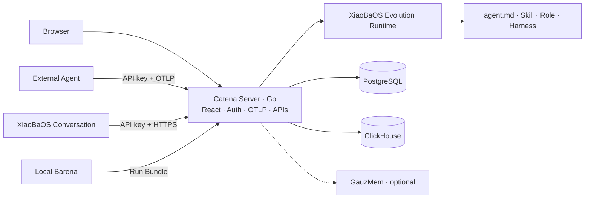

# Catena Product Specification

Status: MVP1 architecture contract
Updated: 2026-08-07

## Problem

Agent behavior changes when its model, Prompt, Role, Skill, Tool, memory or Runtime changes. Catena retains real execution evidence and converts repeated behavior into reviewable Agent assets instead of relying on isolated demos or subjective impressions.

## Scope

Catena owns:

- GitHub OAuth, sessions, project identity and API keys;
- OTLP ingestion, Trace indexing and Span query;
- XiaoBaOS user-visible Conversation ingestion;
- canonical Agent grouping and Agent-scoped Trace windows;
- durable Run, Evidence, Evolution Job and Candidate records;
- an embedded XiaoBaOS Evolution Runtime that produces evidence-linked `agent.md`, Skill and Role assets, plus XiaoBaOS-only Harness proposals;
- an owner-scoped gateway to the optional GauzMem memory service.

Catena does not host the target Agent, execute Explore/Replay/Compare, automatically edit a target repository, or claim that a model review is a release decision. Those execution and verification responsibilities remain in local Barena.

## Current Architecture

React calls only same-origin Go APIs. Go is the sole public backend. The Runner and databases are private services.

## Core contracts

- **Trace:** OTLP/HTTP protobuf or JSON authenticated by project API key.
- **Conversation:** `xiaoba.conversation_batch.v1`, append-only XiaoBaOS user-visible messages.
- **Agent Trace Set:** immutable Agent + time-window snapshot containing at least two server-frozen Trace IDs.
- **Evolution Job:** Inspector → Evolution → Reviewer analysis over one Agent Trace Set.
- **Agent Asset:** evidence-linked `agent.md`, Skill or Role; Harness is valid only for XiaoBaOS.
- **Run Bundle:** idempotent Barena terminal facts plus correlated OTLP evidence.
- **Release truth:** only verifier-backed Barena output may say `cleared`, `held` or `rejected`.

## Security invariants

- Cross-owner reads and writes fail closed.
- Personal API keys are hash-authenticated; owner-only recovery uses an encrypted envelope.
- OAuth state and PKCE validation fail closed.
- Target credentials and arbitrary request templates are not persisted.
- GauzMem is private and receives an owner scope derived by Catena.
- Evolution output is always a proposal and never mutates a target Agent automatically.

## Modules

- [Go control plane](./control-plane/SPEC.md)
- [React Web](./catena-web/SPEC.md)
- [Deployment](./deploy/catena-mvp1/README.md)
- [Barena engine](https://github.com/fightheyyy/barena)
