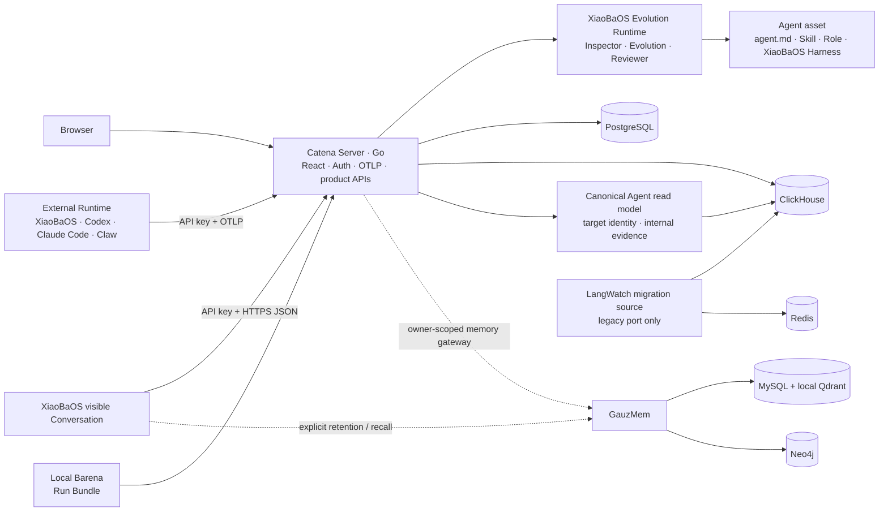

# Catena Product Specification

Status: MVP1 architecture contract
Updated: 2026-08-06

## Problem

Agent behavior changes when a model, Prompt, Role, Skill, Tool, memory,
permission, orchestration rule, or Runtime changes. Conventional unit tests do
not show whether a deployed Agent still completes real user work. Catena joins
production-like Trace evidence with exploration, deterministic Replay, and an
auditable release decision. It also turns explicitly selected Trace evidence
into durable Agent memory so that observation, evaluation, and learning share
one provenance chain.

## Scope

Catena owns:

- the Go platform backend: OAuth/session, project identity, API keys, tenancy,
  job orchestration, audit, and all public product APIs;
- OpenTelemetry/OTLP ingestion, Trace indexing, and Trace query APIs;
- XiaoBaOS `xiaoba.conversation_batch.v1` HTTPS ingestion plus durable,
  owner-scoped Conversation query APIs; this first-party channel is
  intentionally separate from OTLP;
- the React product frontend, built as static assets and served by Go;
- durable Trace, Run, Evolution Job, Issue, Case, Evaluation, and Release records;
- one embedded XiaoBaOS Evolution Runtime that consumes retained Evidence Packs
  and produces evidence-linked `agent.md`, Skill, and Role assets for every
  observed Agent, plus Harness optimization only for XiaoBaOS;
- a tenant-scoped memory gateway that sends explicitly selected XiaoBaOS
  user-visible Conversations to the
  independently deployable GauzMem compiler and returns provenance-bearing
  three-path recall bundles.

Catena does not host or invoke the user's target Agent, infer native behavior
that a Runtime did not export, automatically mutate target repositories, or
treat a Judge/Reviewer opinion as a Release Gate. Target Explore, Replay,
Compare, artifact verification, and release decisions execute in Barena beside
the target Runtime. Catena does not rewrite evolution logic into Go merely to
make the repository single-language: the embedded XiaoBaOS Runtime remains an
independent worker behind a versioned protocol.

## Core concepts

- **Trace**: framework-neutral behavioral evidence received through OTLP.
- **Conversation**: XiaoBaOS-only, append-only user-visible messages received through the versioned Conversation API. It is memory fuel and may reference a Trace, but never contains hidden Runtime execution.
- **Explore Run**: simulated-user interaction used to discover unknown
  behavior boundaries.
- **Issue**: a human-retained, evidence-linked failure statement.
- **Regression Case**: an immutable prompt, fixture, expected behavior, and
  verifier contract derived from an Issue.
- **Replay**: independent execution of a fixed Case against a target version.
- **Agent Trace Set**: an immutable snapshot of one observed Agent's Traces in
  a bounded time window. The server requires at least two Traces and freezes
  the exact included Trace IDs before analysis. It is the cloud Evolution
  input; an individual Trace remains observation/Replay evidence and may seed
  a later Replay Case, but cannot start cloud Evolution.
- **Canonical Agent**: the product identity used to group telemetry emitted by
  one logical Agent through multiple known sources. MVP1 resolves a small,
  deterministic alias family (for example Codex live OTLP and Codex history
  backfill) while every Trace retains its original `service.name` and scope.
  The same resolver classifies first-party workflow sources as either a target
  Agent or internal execution evidence. Only target identities enter the Agent
  Registry and Agent Trace Sets; Barena orchestrators and evaluator roles stay
  visible in Trace Explorer. Unknown OTel sources remain visible through the
  disclosed `service.name` fallback so Catena never silently hides a new Agent.
- **Evolution Job**: InspectorCat → EvolutionCat → ReviewerCat analysis over an
  Agent Trace Set that produces proposals, never an automatic mutation.
- **Release Gate**: Barena-owned terminal decision: `cleared`, `held`, or
  `rejected`.
- **Agent Asset**: an evidence-linked `agent.md`, Skill, or Role produced from
  an Agent Trace Set. XiaoBaOS may additionally receive a Harness optimization;
  Harness is never emitted for another Runtime.
- **Memory Candidate**: a Conversation-derived user/context fact that may be
  committed to GauzMem. It is not a Trace Farm output.
- **Recall Bundle**: semantic seeds plus graph and temporal expansion returned
  by GauzMem with source Conversation provenance.
- **Memory Graph**: one owner-scoped GauzMem Fact neighborhood containing the
  selected Fact, mentioned Entities, and typed Fact-to-Fact Relations. Catena
  derives the private project identity and exposes only the graph evidence.

## Current Architecture

The public Compose entrypoint now serves the standalone React product directly
from Go. The LangWatch downstream remains on a separate legacy port only for
retained-Trace migration and rollback. It is no longer the Catena product
entrypoint and must receive no new platform features.

## Target Architecture

```mermaid
flowchart LR
    subgraph Edge["User environment / CI"]
        direction TB
        Barena["Barena<br/>Explore · Replay · Compare · Verifier"]
        Agent["Target Agent<br/>XiaoBaOS · Codex · Claude Code · Claw"]
        Buffer["Current Run evidence<br/>temporary OTLP + Artifact"]
        Conversation["XiaoBaOS Conversation Journal<br/>user-visible messages"]
        Barena <--> |"Agent Adapter"| Agent
        Agent --> |"Runtime Trace"| Buffer
        Agent --> |"visible chat"| Conversation
        Barena --> |"Boundary Trace"| Buffer
        Buffer --> |"current Run analysis"| Barena
    end

    subgraph Cloud["Catena Cloud"]
        direction TB
        Go["Go + React control plane<br/>identity · project · API key"]
        Facts["Durable facts<br/>Agent · Conversation · Trace · Run · Case · Release"]
        Identity["Canonical Agent identity<br/>target sources only"]
        Selection["Agent Trace Set<br/>Agent + time window"]
        XiaoBa["Embedded XiaoBaOS Evolution Runtime<br/>consumes Evidence, never the target Agent"]
        Candidates["Agent assets<br/>agent.md · Skill · Role<br/>XiaoBaOS Harness"]
        Memory["Conversation memory<br/>GauzMem"]
        Go --> Facts
        Facts --> Identity
        Identity --> Selection
        Selection --> |"Evidence Pack"| XiaoBa
        XiaoBa --> Candidates
        Candidates --> Facts
        Conversation --> Memory
    end

    Buffer --> |"OTLP"| Go
    Conversation --> |"xiaoba.conversation_batch.v1"| Go
    Barena --> |"Run Bundle"| Go
```

The target has one cloud product backend: Go. React never calls an evolution
Runtime or database directly. Barena owns target execution and verification at
the edge; Catena receives OTLP plus an immutable Run Bundle and never changes
the local result when cloud synchronization fails. The embedded XiaoBaOS
Evolution Runtime consumes Catena-owned Evidence Packs and emits
evidence-linked Agent assets. Catena does not create a Replay handoff or claim
that asset generation is a Release decision. GauzMem consumes
Conversation-derived memory rather than being another Trace Farm output.

Evolution is scoped to one observed Agent, not one hand-picked Trace. Agent
classification first applies Catena's deterministic canonical alias resolver
for known multi-source integrations, then falls back to exported OTel
`service.name` for unknown sources. The API returns `identity_source` and the
matched source aliases so the UI can disclose the classification. This is not
a user-editable cross-Runtime registry: it is the minimum identity layer needed
to prevent one logical Agent from splitting when live and historical telemetry
use different emitter names.

## Ownership boundaries

| Component | Owns | Must not own |
| --- | --- | --- |
| React Web | product interaction and visualization | authentication truth, job state, direct engine/database access |
| Go Catena Server | auth, projects/API keys, OTLP, Trace APIs, state machines, queue, lineage, audit | model/evaluator implementation |
| Local Barena | target Explore/Replay/Compare, current-Run analysis, verifier, Release Check, Run Bundle | tenancy, durable Trace history, cross-Run evolution |
| XiaoBaOS Evolution Runtime | Evidence Pack analysis and `agent.md`/Skill/Role assets; XiaoBaOS-only Harness optimization | target Agent execution, release authority, direct database access |
| GauzMem | source/chunk/fact compilation and semantic, graph, temporal recall | Catena identity, raw Trace ownership, release decisions |
| External Runtime | actual Agent behavior and native telemetry | evaluation verdicts |

## Contracts

- Edge telemetry: OTLP/HTTP protobuf with project API-key authentication.
- XiaoBaOS visible chat: versioned HTTPS JSON with the same project/personal API-key authentication. `xiaoba.conversation_batch.v1` is idempotent by owner + message ID and is not an OTLP signal.
- Trace correlation: W3C Trace Context and stable `trace_id`.
- Agent correlation: canonical Agent IDs resolve to one or more exact OTel
  source aliases. Agent-scoped Trace queries and Trace Set snapshots expand the
  canonical ID server-side; individual Trace responses preserve the original
  source identity.
- Agent summaries expose `sources[]` entries with the original `service_name`
  and a bounded source kind (`native_live`, `history_backfill`, or `otel`).
- Codex history import: one deterministic turn root span plus deterministic
  child spans reconstructed from each `function_call` / `function_call_output`
  pair. Re-importing the same rollout must update the same span identities,
  not duplicate evidence.
- Browser → Go: same-origin JSON and SSE authenticated by an HTTP-only session.
- Browser OAuth uses the configured GitHub callback origin as the canonical
  authentication origin. A login started from another loopback alias is
  redirected there before state/PKCE cookies are issued; API and OTLP traffic
  remain available on either bound loopback address.
- Edge → Go: project API key plus OTLP/HTTP protobuf or JSON.
- Go → XiaoBaOS Evolution Runtime: a versioned Evidence Pack containing one
  immutable Agent Trace Set with at least two server-frozen Trace IDs and stage
  Event contracts; the Runtime returns one evidence-linked Agent asset.
- `agent.md` asset content uses `{ "path": "agent.md", "markdown": "..." }`.
  Skill and Role remain portable structured assets; `harness` is accepted only
  when the canonical source Agent is XiaoBaOS.
- Legacy single-Trace Evolution APIs and completed Jobs remain readable for
  compatibility only. The current product UI does not expose a single-Trace
  Evolution launcher.
- Barena → Go: idempotent Run Bundle synchronization plus correlated OTLP.
- Go → GauzMem: private HTTP; Catena supplies the authenticated owner scope,
  a bounded/redacted user-visible Conversation document, and stable source
  Conversation metadata. The legacy Trace endpoint remains compatibility-only
  and has no product UI entry. Fact graph reads follow the same private,
  owner-derived boundary and never expose the GauzMem project ID.
- Durable records: project-scoped PostgreSQL rows; raw spans remain in
  ClickHouse.
- Release truth: only a valid Barena terminal package may create a Release
  Gate record.

## Security invariants

- Target credentials and arbitrary request templates are not persisted in the
  Go control plane.
- Cross-project reads and mutations fail closed.
- Catena never applies inherited SaaS plan visibility windows to Trace data;
  operator retention, project RBAC, and data-privacy policy remain independent
  enforcement boundaries.
- Personal API tokens are authenticated by a one-way hash and stored in a
  separate encrypted recovery envelope. Only the authenticated owner may
  request one token for clipboard copy; token values never enter evolution
  evidence, Trace payloads, logs, or list responses.
- OAuth secrets, absolute host paths, and hidden reasoning are never returned
  as evolution evidence.
- OAuth callback state and PKCE verification fail closed. Host normalization
  must happen before the flow begins and must never be used to accept a callback
  whose state cookie is missing or mismatched.
- An Agent asset remains a trace-grounded proposal. ReviewerCat may approve its
  grounding, but Catena does not represent that review as a Release decision.
- Conversation-to-memory writes require an explicit product action; normal
  Conversation synchronization and OTLP ingestion never silently train or
  mutate memory.
- GauzMem is not publicly exposed and cannot accept a browser-selected tenant
  identity. Catena derives the memory project from the authenticated owner.
- Public ports bind to loopback in the default Compose configuration.

## Module specifications

- [Go control plane](./control-plane/SPEC.md)
- [React Web](./catena-web/SPEC.md)
- [MVP deployment](./deploy/catena-mvp1/README.md)
- [Barena engine](https://github.com/fightheyyy/barena)
