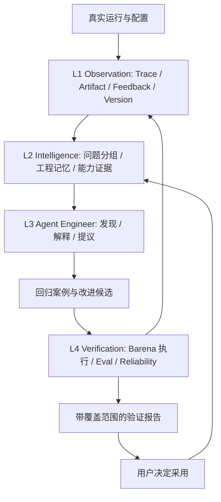

# Catena — Trace-native Agent Engineer

> 从 Agent 的真实运行中发现值得处理的问题，积累工程经验，提出改进，并用测试验证效果。

- 状态：产品方向与分阶段设计提案；新能力不代表已经实现。
- 更新：2026-09-30。
- 主线：真实运行 → 有证据的问题 → 工程记忆 → 回归案例 → 改进候选 → 验证 → 人工决定采用。
- 技术子 spec：[Stateful Reliability Engine](docs/specs/STATEFUL_RELIABILITY.md)。
- 底座采用决策：[Technology Adoption](docs/specs/TECHNOLOGY_ADOPTION.md)。
- 旧 spec 完整备份：[Workspace Spec](docs/specs/CATENA_WORKSPACE_SPEC_20260916.md)。备份标题日期沿用原更新时间，内容是本次修改前的实际工作区版本。

## 1. 产品定位与用户

Catena 帮助 Agent 开发者少花时间翻运行记录、少重复修同类问题，更有把握地修改 Agent。Trace 是最早接入的观察来源，配置、测试和人工反馈共同决定结论是否可信。可靠性引擎是验证能力，不是用户入口。

第一版目标用户：持续维护一个工具型 Agent 或可复用 Agent 配置、反复修改 Prompt/Skill/工具协议，并已有真实失败记录的开发者。先服务单个维护者，再扩展到团队。

仅用编程 Agent 写普通业务代码的人，不自动属于目标用户；除非他维护重复工作流或 Agent 配置。Team Memory 是产品方向，不表示当前已有组织成员和共享权限。

**待验证的需求假设：开发者愿意使用一个从自己的记录中找出反复发生的问题、提供证据并减少修复验证工作的工具。** 尚无外部用户证据证明这一点。

### 第一次使用的价值

导入已有记录后，得到少量可核对的问题卡：发生了什么、哪些运行受影响、已知事实与推测分别是什么、下一步做什么。无需先写 Scenario DSL、搭 World 或配置故障注入。

首次成功是“用户确认一个值得处理的问题”，不是生成总结或图表。证据不足时显示缺什么，没有发现明显问题也是有效结果。

### 竞争与差异假设

Trace 聚类、Insights、从失败生成测试和验证改动已有成熟产品投入，不能说是空白。LangSmith 官方已描述类似闭环和 Insights Agent。[官方说明](https://www.langchain.com/blog/traces-start-agent-improvement-loop)

Catena 暂定差异：利用现有本地 Agent 采集与候选资产能力，降低“真实失败 → 可审查的 Skill/Prompt 改进 → 再次验证”的操作成本，并保留跨版本的失败和决策经验。状态可靠性提供必要时的深入验证。

必须与用户现有的日志工具、编程 Agent 和手工测试比较。Team Memory 的价值来自准确、相关和持续使用，不能仅凭积累数据就称为壁垒。

## 2. 当前资产与范围

| 能力 | 当前依据 | 本轮方向 |
|---|---|---|
| Codex CLI / Claude Code / 通用 OTLP 接入 | Tap、README、schema | 复用，保留来源与可见性边界 |
| Agent / Session / Trace 查看 | Go/React、ClickHouse | 复用，避免重建 Trace UI |
| Conversation / 个人记忆 | XiaoBaOS 对话、可选 GauzMem | 保持原语义，与工程记忆分离 |
| Trace Set → Inspector/Evolution/Reviewer → 候选 | Job、Candidate、产出页面 | 补结构化问题、反馈与验证关联 |
| Run Bundle / Scenario adoption | 现有控制面协议 | 扩展，不宣称已有任意 Trace 自动重放 |
| 增量失败发现、聚类、工程记忆 | 新设计 | M0 最小实现 |
| 回归案例与候选验证闭环 | 现有局部执行/证据路径 | M1–M4 接通并验收 |
| 组织协作、外部通知、任意 Agent 支持 | 未验证 | 不宣称已支持 |

本次检查了文档与关键源码，未重新验收部署或历史数据量。“3.5 万 Span”等数量不是本次确认事实，分析前按 owner、来源、时间窗实际清点。历史开发会话不得自动称为生产数据。

第一版不做自主合并/发布、通用 Runtime、整体重做观测底座、同时支持所有候选类型。不能承诺任意 Trace 精确归因或一键重放。

本文件不决定封存 xiaobaOS 或停止 GauzMem；相关能力可复用，外部项目取舍另行决定。

## 3. 用户流程

1. 连接或手动导入一个已有支持来源，确认读取范围。
2. 对固定时间窗和不可变 Trace Set 分析，显示数据缺口与预算。
3. 查看少量问题卡，跳到实际调用、结果和用户反馈。
4. 标记值得处理、正常行为、已知问题或证据不足，必要时纠正分组。
5. 为确认的问题生成回归草案，显示缺失的环境、版本与期望。
6. 获取范围明确的候选文件或修改建议，附原因与测试计划。
7. 在端侧验证 baseline/candidate，查看改善、退化与未覆盖项。
8. 用户决定采用或拒绝，保存理由，下次遇到相似问题时引用。

M0 交付第 1–4 步与最小工程记忆；后续阶段接通余下链路。

## 4. 四层架构

```mermaid
flowchart TD
    Source[真实运行与配置] --> L1[L1 Observation: Trace / Artifact / Feedback / Version]
    L1 --> L2[L2 Intelligence: 问题分组 / 工程记忆 / 能力证据]
    L2 --> L3[L3 Agent Engineer: 发现 / 解释 / 提议]
    L3 --> Case[回归案例与改进候选]
    Case --> L4[L4 Verification: Barena 执行 / Eval / Reliability]
    L4 --> Report[带覆盖范围的验证报告]
    Report --> Human[用户决定采用]
    Human --> L2
    L4 --> L1
```

### L1 Observation

Trace 从第一阶段接入；逐步关联 Artifact、Eval、人工反馈、代码提交、Prompt/Skill/工具 schema 版本。缺失版本记为 unknown，不能用分析时的最新配置替代运行时配置。

Evidence Envelope 包含 owner、agent、source、native IDs、采集/运行时间、内容摘要、可见性/缺口、可选版本引用。Run reconstruction 只用原生 task/session/turn/call 关联，不因时间接近或提示相似拼接任务。

Trace 不一定覆盖实际业务效果。保留 Attempt / Effect / Observation：Observation 是实际送达给 Agent 的内容，不等于已经知道其内部信念。没有权威 effect 证据只能说“重复调用”，不能说“重复退款”。

### L2 Intelligence：工程记忆

先实现带来源、状态与适用范围的持久记录，不要求先建知识图谱或完整世界模型。

| 类型 | 内容 | 成立条件 |
|---|---|---|
| Operational | 工具/环境中的处理经验 | 有来源、适用版本与反例 |
| Failure | 重复失败模式与处置历史 | 可审查、拆分、合并 |
| Capability | 某版本在指定案例集上的表现 | 绑定条件、样本量、verifier 与覆盖 |
| Decision | 维护者接受或拒绝方案的理由 | 必须是真实人工决定 |

公共字段：ID、owner/scope、类型、正文、evidence_refs、适用 agent/version、状态、复核时间、替代关系、反例、人工反馈。状态区分 hypothesis/supported/disputed/superseded。

单条 Trace 可形成假设，不自动成为普遍规律；相似度不是同根因概率。版本变化或出现反例后重新核验。来源删除时使派生记录失效或删除其敏感内容，不保留无法支持的有效断言。

记忆后端统一采用我们自己的 GauzMem，复用现有接入并扩展工程记忆语义。个人记忆仍只来自用户可见 Conversation；工程记忆使用独立 namespace、实体与 UI 标签。M0 接通工程记忆的最小写入与召回链路，新增能力需实际验收，不视为已经具备。组织共享前必须建立 membership/RBAC，禁止跨 owner 聚类与检索。

### L3 Agent Engineer

Observe → Group → Detect → Explain → Propose。先按确定性信号筛选，再让模型解释有限证据，不为填满首页制造洞察。

M0 覆盖明确工具错误且未见恢复、重复调用/无进展循环、已有测试或人工反馈确认失败的运行分组。正常轮询允许标记例外；缺乏业务终态时，错误完成声明只能作为待核对问题。

归因分类可含 MODEL、CONTEXT、PROMPT、SKILL、TOOL、ROUTING、MEMORY、HARNESS、INFRA、POLICY、UNKNOWN。允许多个原因，分别附支持/反对证据。通过有控制的修改实验后才能加强因果判断。

### L4 Verification

优先使用已有测试、输出规则、文件断言或业务检查；只有写操作、恢复、授权和动态状态案例才需要 World、Effect Ledger、故障与时序契约。详见 [引擎 spec](docs/specs/STATEFUL_RELIABILITY.md)。

执行属于 Barena/端侧，Catena 保存和展示证据。Harbor/Laminar 采用记录不等于迁移全部完成，也不证明其已有精确故障 hook。

沿用 PASS/FAIL/INCONCLUSIVE/ERROR/UNSUPPORTED，并区分执行侧报告与独立复核结果。Reviewer 的建议通过不能代替测试通过。

## 5. 问题卡与主动运行

问题卡必须包含：事实、时间窗、受影响运行数/合格分母、样本证据、影响、已有经验、未知项、建议下一步。未知不算失败，Span 数不冒充任务数。

格式示例，非实测数据：最近 20 次登录任务中，6 次包含认证过期错误，其中 4 次随后重复点击且未见成功记录。建议核对这些运行是否失败，再建立恢复案例；当前没有服务端登录状态，无法确定根因。

不展示未经校准的“根因置信度 91%”。用户可以确认、纠正、忽略、合并和拆分问题。

- 首次手动分析；用户启用后按数据水位或设定周期增量运行。此 spec 不创建实际后台自动化。
- 持久 cursor、幂等 job 与重叠窗口处理迟到数据，重复导入不重复生成卡片。
- 按 owner/agent/pattern/版本范围归并；已有问题更新证据，状态不变不重复提醒。
- 默认只显示站内待处理项，外部通知单独启用；可静音模式、调整范围和停止分析。
- 每周期限制数据量、模型费用与展示数量，达到预算显示未覆盖范围。
- 导入失败、分析失败、证据不足、未发现问题分别呈现。

## 6. Trace 到回归案例

Case 草案必须带来源、输入、目标版本、公开配置引用、工具/环境、初始状态或 fixture、期望行为、verifier 和预算。状态为 draft → needs_context → runnable → baseline_reproduced。

缺失数据库快照、Skill 版本或登录态时明确请求补齐，凭证在执行时配置，不从 Trace 导出到案例。将验证分为原环境复现、受控模拟、新测试假设；模拟故障不能声称原事故已经重现。

baseline 未复现时，candidate 通过不能表示原问题已修复。人工认可案例只确认期望与范围，不替代运行验证。

## 7. 候选与采用

首批新增改进优先 Prompt/Skill/AGENTS.md，复用现有产物能力。Tool/Policy/Routing/Harness 先允许形成建议，代码补丁按验证条件逐类开放。原有 Role/DSH 支持边界保持。

候选必须关联 finding/case、目标文件与基线摘要、修改、适用版本、预期影响、测试计划。基线变化标记 stale，不自动套用。

生命周期为 draft/unverified → ready_for_test → tested → accepted/rejected。tested 独立记录通过、失败、不确定与覆盖，不等于可发布。

验证同时包含发现问题的案例和独立回归案例，版本化数据集与判定条件，不能静默改分母。报告同条件 baseline/candidate、重复次数、改善/退化、成本与未覆盖项；不同任务分布的成功率差异不是可归因的改进。

只说“本次 N 个案例未观察到新的退化”，不承诺全局无回归。沿用 [ADR 0003](docs/catena/architecture/adr/0003-evolution-candidates-are-proposals.md)：不自动修改目标，只有独立 Barena release 记录表达 cleared/held/rejected。批准验证和批准发布是不同动作。

## 8. 工程与兼容契约

采用成熟底座，Catena 负责业务闭环。Engineer 新后端首选 OpenAI Agents API，候选生成复用其 Codex harness；云端工作区首选 E2B，评测复用 Harbor/Barena；个人与工程记忆均采用我们自己的 GauzMem，并隔离数据语义；Agent Lightning Skill 留作后续优化。OTel/Tap 与已有数据/UI 继续复用。具体阶段、适配验收与 OSS 能力边界见 [技术采用决策](docs/specs/TECHNOLOGY_ADOPTION.md)，不要求 M0 同时启动所有服务。

被观察的用户 Agent、Catena Engineer 和被评测的目标 Agent 是三种角色。Agents API 不替换用户原运行时、Codex CLI 采集或 Harbor 的目标 adapter。旧分析后端经过并行验收后才切换，历史记录与在途 Job 保持兼容。

保持 Go/React、Postgres 业务记录与 ClickHouse Trace 查询；浏览器只访问同源 Go API，数据库与 Runtime 私有，不另起平台。

新增 Finding、FailureCluster、EngineeringMemory、RegressionCaseDraft、VerificationLink，以现有 Agent/Trace Set/Job/Candidate/Run Bundle 关联。先定义版本化 JSON 契约，不提前建设通用图数据库。

以下约束继续有效，详见 [旧 spec](docs/specs/CATENA_WORKSPACE_SPEC_20260916.md)：

- 鉴权上下文与 Agent 绑定密钥决定身份，payload 不能覆盖 owner/Agent；OAuth/PKCE 与跨 owner 隔离保持。
- BYOK 密钥加密、按 job 注入，不进入 Trace、候选或 UI；缺少模型配置仍可导入和执行确定性分析。
- 原生事件关联、稳定 IDs、历史重导幂等、bounded reads、最新 Span 替换与精确来源跳转保持。
- Conversation 个人记忆规则保持；工程记忆不扩大旧接口的隐含来源。
- 生成结论不改写源证据，记忆变更显式版本化；原有 Job/Asset 删除与来源保留规则保持。
- 新增数据删除流程需同步撤回派生引用或删除派生敏感内容，不能把已删除数据隐蔽保留在总结中。
- 原有 UI 的局部错误、语言、主题与窄屏能力保持。

Trace、工具返回和仓库文件都是分析数据，不具有指令权限；分析 Agent 不执行其中的命令。数据发送给分析模型的范围可见，密钥与敏感参数在采集/分析边界脱敏。

README 和 UI 当前仍描述已实现能力，本轮不将规划包装成现成功能。源码仍保留的 runner/replay 路径在实施时核对，不扩张为云端目标执行服务。

## 9. 开发顺序与门槛

| 阶段 | 交付 | 验收门槛 |
|---|---|---|
| M0 | 真实记录→分组→证据卡→反馈→最小工程记忆 | 用户确认一个值得处理的问题，并愿意再次使用 |
| M1 | 一个确认问题→可运行 Case | 取得上下文，重现 baseline，区分真实与模拟 |
| M2 | 按案例补验证能力 | 优先现成 verifier，有需要才做 World/故障 |
| M3 | 生成范围明确的候选 | 来源、基线、修改文件和测试计划完整 |
| M4 | baseline/candidate→人工决定→回访 | 外部用户重复使用闭环，再扩功能 |

M0 工程验收：原始身份可追溯，重导不重复，问题有证据和分母，未知不算失败，分组可纠正，跨 owner 不可见。预先抽取包含成功与失败的人工标注集合，检查误报和漏报，不只挑选好看的失败案例。

M0 产品验证建议：招募 5 位目标维护者，至少 3 位完成真实数据分析；至少 2 位确认此前未注意或难定位的可行动问题，并在随后两周主动分析新数据或带来第二个案例。这是暂定决策门槛，不是用户规模预测。

若只愿意看报告而不建案例，评估诊断是否已有独立价值；若卡片持续误报或不值得处理，先调整用户/方法，不继续堆图谱和自动化。不用固定六周期限迫使全部能力同时上线。

## 10. 产品指标

| 指标 | 定义 |
|---|---|
| 首次价值时间 | 首次有效导入到用户确认有用问题，同时报告未达到者 |
| 有用问题比例 | 已审查问题中确认值得处理的比例，未审查单列 |
| 误报/漏报 | 人工抽样集合上的结果，按来源与模式拆分 |
| 二次使用 | 约定窗口内主动分析新数据、提交新案例或重跑修改 |
| Case 可执行率 | 合格已确认问题中完成案例执行的比例，缺失原因分列 |
| 闭环完成率 | 进入修复流程后取得有效比较与人工决定的比例 |
| 用户投入 | 接入、补上下文、审查的时间，与其现有流程比较 |
| 成本 | 每批分析、每个有用问题的模型与执行成本 |

生成多少 Insight、打开多少页面不等于价值。出现二次使用后再验证实际付费意愿，不编造市场规模或定价最优点。

## 11. 界面与文档迁移

复用 Overview/History/Memory/Outputs：Overview 增加少量待处理问题，History 保留原始证据，Memory 区分个人记忆与工程经验，Outputs 补 Case/验证状态。第一版不重建大型工作台。

无问题显示观察覆盖与未发现结果；空数据引导导入；分析失败显示可重试错误，不能用空列表掩盖失败。

本文件定义未来产品方向和优先级；[Reliability Engine](docs/specs/STATEFUL_RELIABILITY.md) 负责 L4 细节，其历史六场景计划不优先于真实数据闭环。现有模块 spec/PLAN 尚未全部同步，实现每个里程碑时更新对应文档与验收。旧 spec 未被明确替代的鉴权、数据语义、隐私和发布约束继续有效。

- [Go 控制面](control-plane/SPEC.md)
- [React Web](catena-web/SPEC.md)
- [Tap](tap/SPEC.md)
- [部署](deploy/catena-mvp1/README.md)
- [Harbor/Laminar 采用记录](docs/CATENA_BARENA_HARBOR_LAMINAR_ADOPTION_20260925.md)

本轮只调整文档，未启用持续观察、通知、自动修改或发布，也未变更其他项目。
