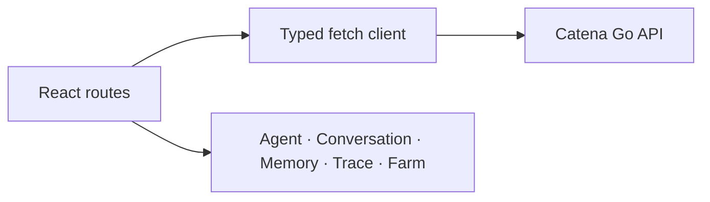

# Catena Web Specification

Status: implemented MVP1 contract
Updated: 2026-08-07

## Responsibilities

The React client presents five primary journeys: Agent, Conversation, Memory, Trace and Trace Farm. It calls same-origin Go APIs only and contains no authentication or workflow source of truth.

## Current Architecture

## Target Architecture

The current architecture remains the target for MVP1. Future work may add reusable data/query primitives, but must not introduce a second backend or direct database/Runner access.

## UX invariants

- The primary navigation is Agent → Conversation → Memory → Trace → Trace Farm.
- Empty states explain the next action rather than exposing internal engine names.
- Trace detail prioritizes Span waterfall, tool calls, input/output and errors.
- Trace Farm starts from an Agent and bounded time window, never one isolated Trace.
- Candidate content is copyable and clearly labeled as a proposal.
- Chinese and English share the same information architecture.
