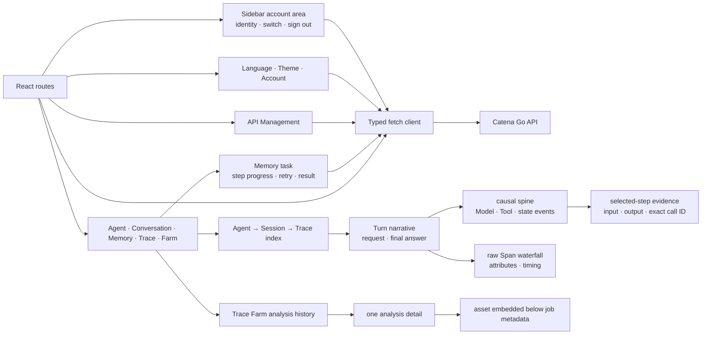
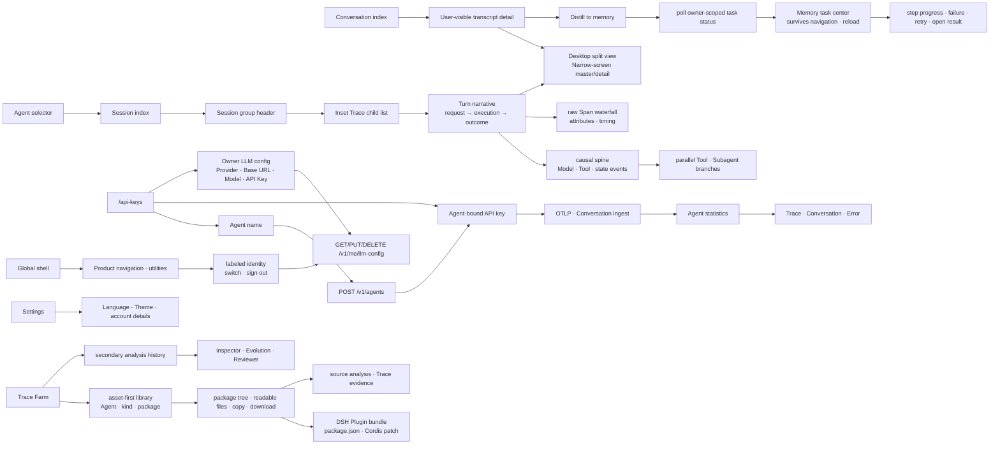

# Catena Web Specification

Status: implemented MVP1 contract
Updated: 2026-08-15

## Responsibilities

The React client presents five primary journeys: Agent, Conversation, Memory, Trace and Trace Farm. It calls same-origin Go APIs only and contains no authentication or workflow source of truth.

## Current Architecture

## Target Architecture

The Agent page is observation-only. `/api-keys` owns Agent identity and
credential creation, reveal, copy and revocation. Runtime is never a form
field; the UI only displays the server's inferred result after evidence arrives.

## UX invariants

- The primary navigation is Agent → Conversation → Memory → Trace → Trace Farm.
- At tablet and mobile widths, API Management and Settings stay visible in a
  utility row above the five product destinations; navigation never relies on
  horizontal scrolling.
- API management asks only for an Agent name when creating a credential.
- A generated key is presented as that Agent's credential, never as an
  independent settings object.
- Agent statistics never creates, reveals or revokes credentials.
- API management keeps one visible row per Agent with status, masked key and
  copy/revoke actions. Copy recovers the secret only for the clipboard and
  never renders a second plaintext credential card.
- Revoking the last credential stops future ingestion but does not delete the
  Agent or retained evidence. The row must say that ingestion is paused and
  history is retained; historical evidence must never be labeled connected.
- Evidence-dependent actions such as Trace Farm are disabled until the Agent
  has enough retained evidence.
- Agent lists prioritize registered product identities. Historical unbound
  telemetry aliases stay available in Trace, not as duplicate primary Agents.
- Agent ID, identity source and raw service aliases live under advanced details.
- Empty states explain the next action rather than exposing internal engine names.
- The empty Agent workspace offers one direct path to API Management for first-time connection.
- Trace detail prioritizes a human-readable Turn narrative: user request,
  model attempts, exact Tool calls/results and final answer. The Span
  waterfall remains complete but is a diagnostics lens, not the default view.
- Catena Canonical Event Graph spans use `catena.node.kind` as their semantic
  source of truth. `subagent`, `retry`, `context_compact` and
  `unmatched_tool_result` keep distinct presentation kinds. Failed Tools remain
  Tool evidence while carrying their error/incomplete state.
- Parallel Tools share one visible branch group. A Subagent opens a nested
  thread with its own Turn, Model and Tool chain while preserving parentage.
- Retry, Context Compact, Abort and Incomplete are visible narrative events;
  none may be reduced to a generic Model row or a successful trace badge.
- Model steps show model, token and timing facts by default. Full request
  history is secondary evidence so repeated context does not drown the causal
  delta between model attempts.
- Cross-process Barena/XiaoBaOS traces are semantic product evidence, not raw
  telemetry noise: `barena.simulation`, `barena.turn`, `xiaoba.model.call` and
  `barena.assertion` render as Run, Turn, Model and Check steps. Runtime wrapper
  spans such as `xiaoba.session` retain their true parentage in Raw Span while
  staying folded in the default chain.
- The default selected step is the first evidence-bearing Turn, not an empty
  model or Runtime wrapper Span. Run and Check details render test facts rather
  than generic input/output envelopes.
- Trace evidence renders semantic payloads rather than transport envelopes:
  `chat_messages` input becomes visible role/content message cards, while its
  `type` and `value` wrapper remains available only under raw data.
- Trace navigation preserves the evidence hierarchy: Agent → Session → Trace →
  Span. Session groups use exported identity only; missing identity appears in
  one explicit ungrouped bucket rather than a fabricated session.
- A Session's scan label is derived locally from its earliest retained valid
  user request. It uses no model call; the exported Session ID remains visible
  as evidence identity and is the fallback when no request text is available.
- Session is rendered as a group container, not as a sibling of Trace. Its
  expanded state is communicated by the group surface and disclosure; the
  selected Trace alone receives the accent selection treatment. Trace root
  names are primary scan labels while opaque Trace IDs remain secondary.
- Each Trace row is one execution from a user request to a terminal answer.
  Its primary title comes from the request evidence; protocol labels such as
  `agent.turn` and Runtime-specific fallback names remain secondary metadata.
- Conversation and Trace use the same master/detail hierarchy: the index selects
  a record, while the detail owns a distinct header, summary and evidence surface.
- At narrow widths, index and detail are separate states with an explicit back
  action; they must never be stacked into one continuous document.
- At 390px, every primary journey keeps `scrollWidth === innerWidth`; long
  Conversation titles wrap inside the detail header instead of widening the page.
- Conversation messages use visibly distinct user and Agent transcript cards.
- Memory distillation never ends at an ambiguous “submitted” label. The
  Conversation detail shows current step and percentage, explains terminal
  failure, permits retry, and links completed work to Memory. The Memory page
  also lists recent tasks so status remains visible after navigation or reload.
- An isolated Fact is not presented as a meaningful graph. When GauzMem has no
  semantic edge, the graph shows only provenance-backed Conversation, Agent or
  same-Conversation context, and labels that context distinctly from semantic
  relations.
- Trace metrics stay compact; narrative steps preserve a stable reading
  position while selected raw Span evidence remains one diagnostic inspection
  unit.
- Trace Farm starts from an Agent and bounded time window, never one isolated Trace.
- Starting an analysis sends the current UI language as an explicit asset-output
  language; Chinese UI produces Chinese assets and English UI produces English assets.
- Trace Farm opens on accumulated Agent assets, not analysis jobs. A completed
  Job is implementation provenance for an asset, not the primary product object.
- Every asset exposes its stable package root, file tree, readable selected
  file, Agent, kind, source Trace count, copy/download, direct deletion and
  source analysis.
- DSH Agents display `DeepSeek Harness`, and `dsh_plugin` appears as a distinct
  Asset Library kind with a whole-package download suitable for local Barena
  acceptance.
- Analysis history, role progress, raw outputs and deletion remain available as
  a secondary audit view without competing with the Asset Library.
- Completed and failed analyses and their generated assets expose a destructive
  two-step delete action in their own context.
  The confirmation states that generated assets are removed while source Trace
  evidence remains; queued and running analyses expose no delete action.
- Candidate content is copyable and clearly labeled as a proposal.
- Chinese and English share the same information architecture.
- API management clearly separates Agent ingestion credentials from the
  owner-provided LLM configuration used by Trace Farm.
- The saved model API Key is never rendered or returned; an empty key while
  editing preserves the current credential.
- Language and theme appear only in Settings, not in the global navigation.
- The current identity lives in the sidebar's utility/account area alongside
  API Management and Settings. It stays visibly labeled at desktop and compact
  widths; switching account and signing out never require opening Settings.
