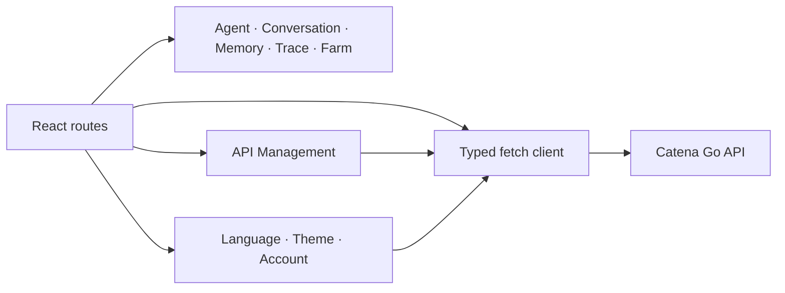
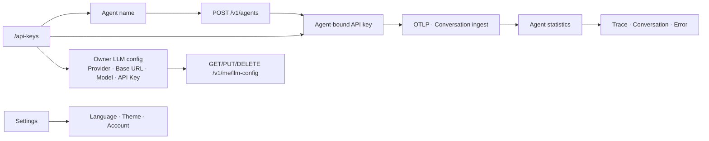

# Catena Web Specification

Status: implemented MVP1 contract
Updated: 2026-08-07

## Responsibilities

The React client presents five primary journeys: Agent, Conversation, Memory, Trace and Trace Farm. It calls same-origin Go APIs only and contains no authentication or workflow source of truth.

## Current Architecture

## Target Architecture

The Agent page is observation-only. `/api-keys` owns Agent identity and
credential creation, reveal, copy and revocation. Runtime is never a form
field; the UI only displays the server's inferred result after evidence arrives.

## UX invariants

- The primary navigation is Agent → Conversation → Memory → Trace → Trace Farm.
- API management asks only for an Agent name when creating a credential.
- A generated key is presented as that Agent's credential, never as an
  independent settings object.
- Agent statistics never creates, reveals or revokes credentials.
- API management keeps one visible row per Agent with status, masked key and
  explicit reveal, copy and revoke actions.
- Evidence-dependent actions such as Trace Farm are disabled until the Agent
  has enough retained evidence.
- Agent lists prioritize registered product identities. Historical unbound
  telemetry aliases stay available in Trace, not as duplicate primary Agents.
- Agent ID, identity source and raw service aliases live under advanced details.
- Empty states explain the next action rather than exposing internal engine names.
- Trace detail prioritizes Span waterfall, tool calls, input/output and errors.
- Trace Farm starts from an Agent and bounded time window, never one isolated Trace.
- Candidate content is copyable and clearly labeled as a proposal.
- Chinese and English share the same information architecture.
- API management clearly separates Agent ingestion credentials from the
  owner-provided LLM configuration used by Trace Farm.
- The saved model API Key is never rendered or returned; an empty key while
  editing preserves the current credential.
- Language and theme appear only in Settings, not in the global navigation.
