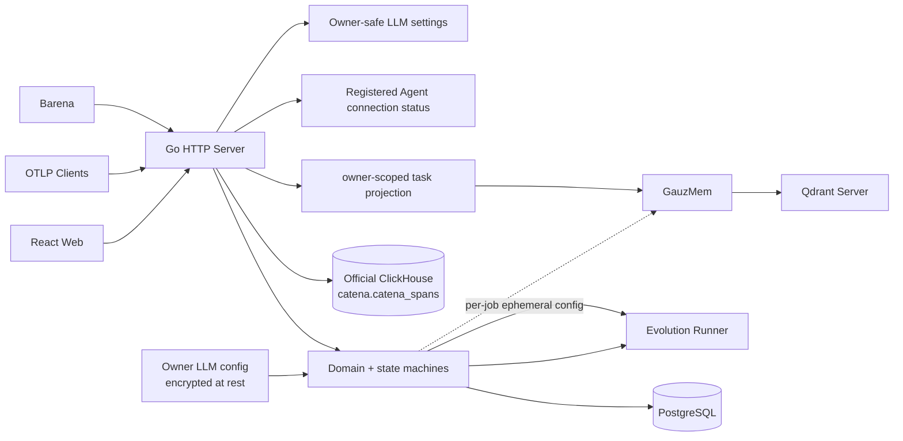
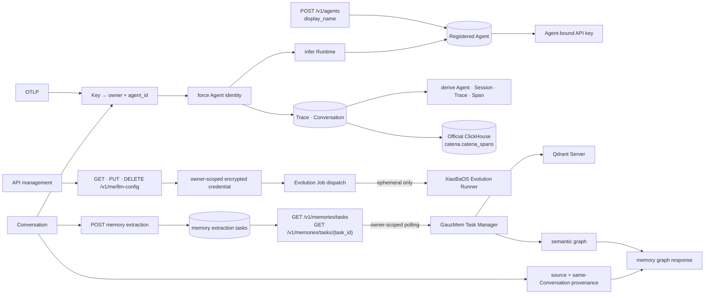

# Catena Control Plane Specification

Status: implemented MVP1 contract
Updated: 2026-08-09

## Responsibilities

The Go server owns public product state and transport:

- OAuth/session, Agent registration and Agent-bound API-key authentication;
- owner-scoped projects and requests;
- OTLP/HTTP ingestion and ClickHouse Trace reads;
- XiaoBaOS Conversation ingestion and PostgreSQL reads;
- canonical Agent resolution without rewriting original telemetry identity;
- immutable Agent Trace Sets and Evolution Job state;
- versioned Evidence Pack delivery to the private Runner;
- Candidate provenance and audit;
- same-origin React static asset serving;
- private GauzMem gateway.

It does not implement model reasoning, execute the target Agent, calculate Barena verifier results or let workers write product databases directly.

## Current Architecture

## Target Architecture

Existing tokens with no `agent_id` remain a bounded compatibility path. Every
new token is created atomically with an Agent and cannot change its binding.
The durable worker queue remains the next control-plane reliability milestone.

## Data ownership

- PostgreSQL: identity, credentials, Conversations, Runs, Jobs, Candidates and audit.
- PostgreSQL: owner LLM metadata and an authenticated-encrypted API Key envelope.
- PostgreSQL Registered Agent owns display name, inferred Runtime and key
  binding; payload metadata cannot mutate its stable identity.
- ClickHouse: raw Trace, Span and event evidence.
- ClickHouse Trace summaries derive `agent_id` from authenticated ingestion and
  `session_id` from supported OTel attributes without rewriting raw evidence.
- Runner filesystem: temporary workspaces only.
- GauzMem stores: optional memory facts and indexes behind the private gateway.

## Invariants

- Every mutation is owner-scoped and validates source ownership.
- New API keys are bound to one Agent; direct ingestion overwrites incoming
  Agent identity from that binding.
- Idempotency keys return the original logical result.
- Agent Trace Set membership is frozen before worker execution.
- Stage events move state forward only; terminal state cannot be overwritten by stale events.
- Only an owning user may delete a completed or failed Evolution Job. Deletion removes its embedded Candidate assets but never cascades to source Trace or Conversation evidence.
- Candidate provenance contains the exact Evidence Pack and Trace IDs.
- OAuth state/PKCE, API-key hashing and token recovery remain fail-closed.
- Owner LLM APIs may expose Provider, Base URL, Model and key presence, but
  never return the Evolution model API Key.
- Evolution execution fails clearly when the owner has no complete LLM config;
  model secrets exist in memory and the private Runner request only.
- Cloud synchronization failure never changes a local Barena decision.

## Public contracts

- `POST /v1/agents`: atomically create Registered Agent and its initial key.
- `GET /v1/agents/{agent_id}`: cheap PostgreSQL-backed connection polling.
- `GET /v1/agents`: registered Agents merged with evidence metrics.
- `/v1/otlp/v1/traces`: Agent-key-authenticated OTLP/HTTP ingestion.
- In loopback local mode, Agent registration and Agent-key ingestion remain
  available to the implicit `local` workspace; disabling OAuth never disables
  the product's local evidence path. Public mode still uses authenticated
  human sessions for credential management.
- `GET /v1/traces` and Agent Trace windows: each summary includes its stable
  Agent identity and an optional exported Session identity.
- `/v1/ingest/conversations`: `xiaoba.conversation_batch.v1`.
- `/v1/ingest/run-bundles`: idempotent `barena.run_bundle.v1`.
- `/v1/evolution-jobs`: Agent Trace Set creation, listing and detail.
- `DELETE /v1/evolution-jobs/{job_id}`: owner-scoped terminal analysis deletion; queued and running Jobs return a conflict.
- `/v1/memories`: private-backend memory operations through owner-derived scope.
- `GET /v1/memories/tasks/{task_id}`: owner-scoped projection of GauzMem
  progress and terminal failure; the private project identifier is never
  returned.
- `GET /v1/memories/tasks`: owner-scoped recent extraction tasks persisted by
  Catena, including their source Conversation and last known state.
- A fact-graph response may be augmented with source Conversation, Agent and
  same-Conversation adjacency derived from stored provenance. Such structural
  edges are explicitly typed and never presented as model-inferred semantic truth.
- `GET/PUT/DELETE /v1/me/llm-config`: authenticated owner-provided Evolution
  model configuration; GET never returns the API Key.

OTLP normalization accepts Catena and standard OpenTelemetry/GenAI attributes.
Product-specific aliases from the retired platform are not part of the public
contract.
