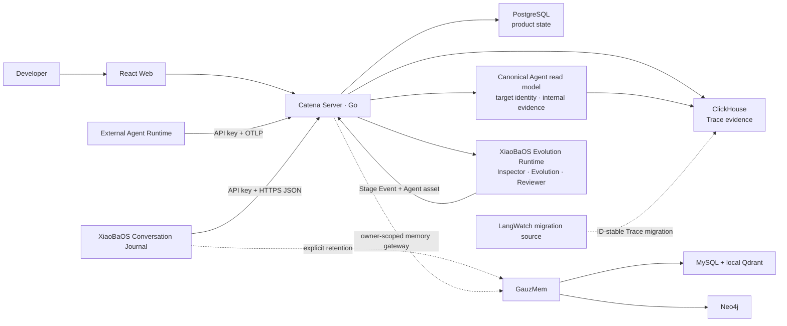
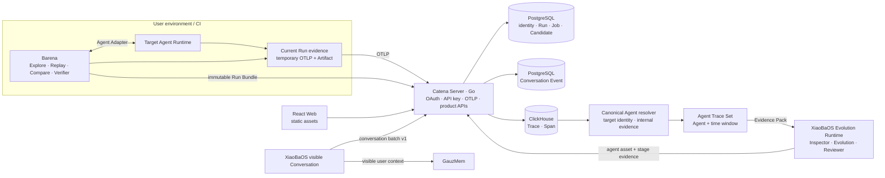
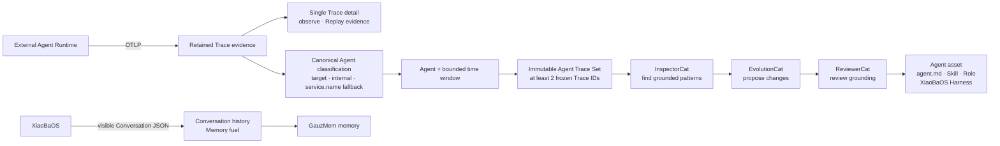
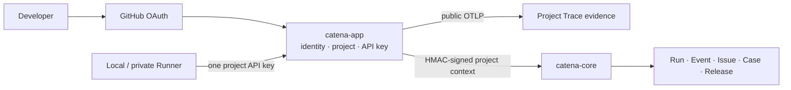

# Catena Control Plane Specification

Updated 2026-08-06.

## Purpose

The Catena server is the Go product backend and durable evidence control plane
for Agent Runtimes. It receives cross-Agent OTLP and immutable Barena Run
Bundles, turns retained evidence into versioned Evidence Packs, and coordinates
a restricted XiaoBaOS Evolution Runtime. It is more than a Trace viewer, but it
is not a second deterministic evaluation Engine and never hosts the user's
target Agent Runtime.

For the first-party XiaoBaOS integration it also receives a separate versioned
Conversation stream containing only messages actually visible to the user.
Conversation is durable product data for memory evolution; OTLP remains
execution evidence for portable Agent assets and XiaoBaOS Harness optimization.

XiaoBaOS is the first-party reference integration; OpenClaw, Claude Code,
Codex, Hermes, and other Runtimes use Barena's local Adapter and OTel contracts.
The target Agent Runtime always remains external. Catena embeds a distinct
XiaoBaOS Evolution Runtime for InspectorCat, EvolutionCat, and ReviewerCat
evidence consumption; UserCat remains part of active Barena Explore beside the
target. The historical Platform HTTP Explore path remains compatibility/demo
code, not the target execution boundary.

The first product loop is:

`local Agent/Barena -> Trace + Run Bundle -> Evidence Pack -> Agent asset`

Replay, Compare, verifier semantics, and Release remain local Barena
capabilities. Catena stores their terminal facts but does not recompute them.

## MVP1 Product Contract

MVP1 is a locally deployable proof of the Trace-to-candidate portion of the
evolution loop. XiaoBaOS is the first-party live acceptance target and the
embedded evidence-consumption Runtime.

One developer can:

1. authenticate, create one API key, and connect an OTel-capable Agent or local
   Barena;
2. inspect the complete Trace waterfall, including tool input/output;
3. select one observed Agent and a bounded time window, then start one
   idempotent Evolution Job from the resulting immutable Trace Set;
4. watch InspectorCat, EvolutionCat, and ReviewerCat consume a durable Evidence
   Pack;
5. inspect and copy an evidence-linked `agent.md`, Skill, or Role asset; a
   XiaoBaOS source may also produce a Harness optimization.

MVP1 may use loopback deployment. It does not require a cloud scheduler,
endpoint tunnel, automatic mutation, multi-Runtime
execution parity, or production tenancy hardening.
The standalone React application is served by this Go server and calls only
same-origin Go APIs. The LangWatch path remains runnable only to migrate its
retained Traces and to preserve Scenario behavior until the Engine Runner has
parity; it is not a second target product backend.

## Current Architecture

The repository now contains a runnable replacement slice: Go serves the React
product, authenticates users and API tokens, accepts OTLP/HTTP protobuf or
JSON, persists owner-scoped spans in ClickHouse, and exposes Trace, Agent, and
Evolution APIs. Go persists product state in PostgreSQL and invokes independent
engine workers. The original LangWatch slice remains a legacy-port migration
and rollback source for retained Traces.



The four-container release topology is authoritative. The legacy source is
available only through an opt-in migration profile and is not on the product
request path.

## Target Architecture



Go owns every cloud management concern: identity, authorization, tenancy, API
keys, public APIs, evolution-job state, audit, OTLP ingress, Trace queries, and
Agent-asset lifecycle. Local Barena owns every target-execution and release
concern independently; Catena does not create a Replay handoff. The embedded
XiaoBaOS Runtime receives versioned Evidence Packs and returns stage Events plus
Agent assets; it has no target Agent Adapter and no release authority.

Conversation ingestion is a narrow first-party exception to framework-neutral
OTLP observation. The request schema is `xiaoba.conversation_batch.v1`; every
row is a `xiaoba.conversation_message.v1` with a stable message ID, conversation
ID, sequence, surface, Agent identity, user-visible content, delivery status,
timestamp, and optional Trace ID. Go accepts only `runtime=xiaobaos`, stores
events idempotently per owner, and never derives hidden messages from spans.

Evolution is scoped to one observed Agent, not one hand-picked Trace. Catena
snapshots the Agent's owned Traces inside a bounded time window and records
`source_kind=agent_trace_set`, `source_agent_id`, the exact immutable
`source_trace_ids`, and the requested window. An individual Trace remains an
observation/replay evidence unit and never starts cloud Evolution directly.
The set must contain at least two owned Traces. Agent classification uses a
deterministic source registry for known integrations. It first distinguishes
target-Agent telemetry from internal workflow evidence, then resolves target
aliases, beginning with
Codex live OTLP (`codex`, `codex-app-server`) and Codex historical backfill
(`Codex Desktop`). Agent-scoped queries expand the canonical ID to all exact
aliases, while Trace rows retain the original `service.name`. Unknown sources
fall back to their exported `service.name`. Responses include
`identity_source` and source aliases so callers can disclose the grouping.
Known Barena orchestration, User Simulator, Inspector, and Reviewer sources are
internal evidence: they remain queryable in Trace Explorer but never become
Agent Registry rows or Agent Trace Set inputs. A known Barena target source is
classified as the observed target Agent. Unknown sources fail open into the
Registry instead of being hidden.
This is intentionally not a user-editable, heuristic cross-Runtime registry.
When local Barena does have execution facts, it sends one
authenticated, idempotent `barena.run_bundle.v1`; Catena verifies the opaque
terminal-fact hash and atomically retains the Run and ordered Events without
recomputing a scorecard or Release decision. Catena's separate
versioned Evolution Evidence Pack is bounded and redacted but contains the real
Trace summaries, spans, inputs, outputs, and tool evidence selected from
ClickHouse.

GauzMem is a separate stateful capability rather than an Engine Runner child
process. Go retrieves the owned XiaoBaOS user-visible Conversation from its
Conversation store, builds a bounded and redacted memory document, attaches
stable provenance, and calls GauzMem on the private Compose network. GauzMem
never receives a browser-provided tenant as authority and never writes Catena
product tables. Go additionally exposes one owner-scoped Fact-neighborhood
read contract: it derives the opaque GauzMem project from the authenticated
owner and proxies a bounded Fact/Entity/Relation graph without exposing the
project ID or provider errors. The older Trace-memory endpoint is
compatibility-only.

MVP1 proves the loop with retained OTLP evidence and PostgreSQL: the developer
selects an observed Agent and bounded time window, Go freezes at least two exact
Trace IDs into one immutable Agent Trace Set, and the XiaoBaOS Evolution Runtime
runs InspectorCat, EvolutionCat, and ReviewerCat over that set. Every output is
stored with its source Agent, frozen Trace IDs, and Evidence Pack digest.

The standalone React client is the MVP1 product surface. The inherited
LangWatch UI is compatibility scaffolding and must not receive new product
features.

## Product Workflow

Catena is a Trace-to-evolution developer console with one restricted Evolution
Runtime. It is not a general-purpose hosted target Runtime. Local Barena runs
UserCat, the target conversation, Replay, Compare, artifact verification, and
Release Check. Catena receives the resulting OTLP and immutable Run Bundle,
then its dedicated XiaoBaOS worker runs InspectorCat, EvolutionCat, and
ReviewerCat over an Evidence Pack. The current outputs are portable `agent.md`,
Skill, and Role assets; only XiaoBaOS may receive a Harness optimization. Memory
is derived from Conversation, not Trace Farm. The cloud never opens a persistent
tunnel into a developer laptop.



Go authenticates browser and Runner requests and keeps project-scoped product
state. Local/private execution remains a CLI or endpoint-runner responsibility;
neither path becomes a second product backend.

## Final Source of Truth

| Component | Owns | Must not own |
| --- | --- | --- |
| React Web | Product interaction and evidence visualization | Authentication truth, job state, direct engine or database access |
| Go Catena Server | OAuth/session, tenancy, API keys, public APIs, OTLP, Trace queries, durable state, lineage, audit, and orchestration | Model reasoning, verifier semantics, or engine implementation |
| Local Barena | Target Explore/Replay/Compare, current-Run evidence, verifier facts, Release Check, immutable Run Bundle | Tenancy, durable Trace storage, cross-Run evolution |
| XiaoBaOS Evolution Runtime | Inspector/Evolution/Reviewer stages and draft candidates over Evidence Packs | Target execution, release authority, direct database access |
| GauzMem | Memory compilation and semantic, graph, and temporal recall | OAuth, Catena tenancy, raw Trace query, Candidate approval, or release state |
| External Agent Runtime | Actual target behavior, tools, artifacts, and native telemetry | Catena evaluation or release authority |

This division is normative. “Go owns decision records” means it validates,
persists, and audits the decision produced by the TypeScript Engine; it does not
re-run the decision policy.

## V1 Flywheel

1. A target Runtime executes locally and exports OTLP; local Barena optionally
   adds boundary Trace, artifacts, evaluator evidence, and a terminal Run
   Bundle.
2. Catena retains Trace/Run facts without re-executing the target Agent.
3. The developer chooses an Agent and time window. Catena freezes the matching
   Trace IDs as one integrity-protected Agent Trace Set Evidence Pack.
4. InspectorCat identifies a grounded failure mode; EvolutionCat emits one
   `agent.md`, Skill, or Role asset, or a XiaoBaOS-only Harness optimization;
   ReviewerCat checks grounding and coherence.
5. Catena stores the asset with its immutable Trace provenance and exposes the
   deployable content directly. Conversation-derived memory follows the separate
   GauzMem path.

The fork's identity/configuration PostgreSQL data and ClickHouse Trace data are
separate from the Barena evolution-domain schema. They may share physical
infrastructure, but no service may use cross-service joins, foreign keys, or
direct table reads.

### Legacy Run/Issue/Case compatibility contract

The following contract remains for completed historical workflows and local
Barena synchronization. It is not the cloud Evolution creation unit, and the
current product UI does not expose it as an alternative to Agent Trace Set
analysis.

An Issue is mutable review state over immutable evidence references:

```text
issue_id
source_run_id
source_trace_id?
title
summary
severity
status = open | promoted | dismissed
```

A promoted Case revision is immutable:

```text
case_id
revision = 1
source_issue_id
source_run_id
source_trace_id?
operation
input
runtime / harness context
success_criteria
verifier
```

Promotion is idempotent. The same Issue cannot create two Case revisions.
Promotion fails closed when the source Run is missing, belongs to another
owner/project, or the supplied Trace ID is not present in that Run's retained
Engine Events.

## Product Surfaces

- **Agents** classifies retained OTLP by canonical target-Agent identity,
  discloses `identity_source` and original source aliases, omits known internal
  workflow sources, and exposes the primary Agent Trace Set analysis entry.
- **Traces** searches retained OTLP and opens a span waterfall. A single Trace
  supports observation and Replay provenance only.
- **Conversations** lists XiaoBaOS user-visible chats and their messages. It
  never displays system prompts, thinking, hidden final text, or tool internals;
  it owns the explicit Conversation-to-memory action.
- **Memory** recalls and navigates one real owner-scoped Fact neighborhood at a
  time. `GET /v1/memories/facts/{fact_id}/graph` accepts only a positive Fact
  ID, derives tenancy server-side, and returns Fact, Entity, and typed Relation
  evidence from the private GauzMem graph path.
- **Trace Farm** selects an Agent and bounded time window, previews the matching
  count, and opens the idempotent Agent Trace Set Evolution Job.
- **Evolution Job** renders Inspector/Evolution/Reviewer stages, exact plural
  Trace provenance, and `draft/unverified` candidates.
- **Settings** manages project connection and API tokens.

Historical Issue, Case, Replay, Compare, and Release records remain API/data
compatibility surfaces for local Barena facts; they are not parallel cloud
Evolution launchers in the current Web journey.

Community profiles and public capability cards are retained as experimental
code, but are not part of the v1 primary journey.

## Contracts and Boundaries

Agent summaries use this additive read contract:

```text
agent_id
display_name
identity_source = catena.alias | service.name
sources[] = { service_name, kind = native_live | history_backfill | otel }
trace_count / span_count / error_count / last_seen_at
```

The canonical ID is accepted by both Agent Trace and Agent Evolution routes.
Alias expansion is server-owned and deterministic; callers never rewrite a
Trace's original emitter identity.
Internal workflow sources are excluded only from Agent summaries and
Agent-scoped evolution. Their raw Traces and spans are retained unchanged and
remain available through the global Trace API.

- Platform HTTP Explore uses the existing Apache-2.0 Scenario runtime. Its
  User Simulator and Judge result are source execution facts, not a Barena
  Release decision. Local/private Explore remains in the TypeScript Engine.
- The TypeScript Engine remains the only implementation of deterministic
  Replay, artifact verification, scorecard computation, and Release Check.
- The Barena Platform fork owns login, organizations/projects, membership,
  public API keys, OTLP ingestion, Trace storage/search, and the Web shell.
- The Go service owns Run/Event persistence, Issue review, Case promotion,
  Harness Version lineage, immutable Run Packages, scorecard/release records,
  live delivery, cancellation state, audit, and Trace correlation. It validates
  records produced by the Engine and never computes a second verdict.
- Browser and Runner traffic enters through the fork. The gateway validates the
  existing project identity and forwards signed project context to Go; Go is
  not directly exposed as a second public authentication surface. Go stores
  neither OAuth credentials nor public project API keys.
- In the standalone Go product slice, the configured GitHub redirect origin is
  the canonical browser authentication origin. `/v1/auth/github` redirects an
  alternate loopback host to that origin before issuing state and PKCE cookies;
  callback validation itself remains strict.
- A signed project maps to a stable compatibility principal. Concurrent first
  requests for the same project take a transaction-scoped PostgreSQL advisory
  lock keyed by that identity before upsert; unrelated projects do not block
  each other and a browser batch cannot fail on competing identity indexes.
- Run Events use the existing ordered `barena.engine_event.v1` contract.
  Duplicate Events are idempotent and sequence gaps fail closed.
- Agent-native telemetry uses OTLP and W3C Trace Context. Barena does not
  invent another span protocol.
- XiaoBaOS user-visible chat uses the vendor JSON Conversation contract because
  OTLP content is optional, sampled, truncatable execution telemetry rather
  than an authoritative message history. A Conversation event may carry the
  related `trace_id` for drill-down.
- The Web reads owner-scoped REST/SSE contracts. Raw Trace, prompts, events,
  artifacts, and workspace paths remain private.
- The fork preserves LangWatch's authentication security contract and
  project-level API-key boundary. Barena does not add a second GitHub OAuth
  implementation to the target architecture.
- Loopback local mode remains available for development. Production ingress
  terminates HTTPS before the fork; the internal Go API is network-restricted
  and verifies gateway signatures.
- The pinned fork is the selected Trace substrate. Community code outside
  `langwatch/ee/` is Apache-2.0 at the fork point; attribution and enterprise
  carve-outs are preserved. Barena-specific patches stay small enough for
  regular upstream merges.
- The custom React workbench and per-Run Trace viewer are removed after
  LangWatch-derived Sessions/Issues/Cases/Evaluations/Releases parity. The
  TypeScript Engine and Go continuous-evolution control plane are retained.

## Explicitly Out of Scope for V1

- Reimplementing LangWatch OTLP ingestion, Trace storage, search, login, or
  project membership in Go.
- Moving User Simulator, Judge, verifier, Compare, or Release Check algorithms
  into Go or reimplementing Scenario in Barena.
- A cloud scheduler, job lease, heartbeat manager, persistent tunnel into a
  developer laptop, or Go Runner.
- Direct browser-to-Go access, a second endpoint credential, or shared
  cross-service database queries.
- Hosting XiaoBaOS or another target Runtime inside the Platform. A registered
  HTTP endpoint is invoked over its public contract; local/private targets stay
  beside the CLI.
- Persisting HTTP Agent credentials, authorization headers, or arbitrary body
  templates in Barena Case records. MVP1 Replay supports only the explicit
  no-secret standard HTTP contract and fails closed otherwise.
- Automatic prompt/code mutation or autonomous release. The v1 flywheel
  discovers, curates, verifies, and gates; a human accepts Cases and releases.

## Current Agent Trace Set Acceptance

- [x] An authenticated owner selects one observed Agent and a bounded window
      containing at least two owned Traces.
- [x] Go freezes the exact included Trace IDs before invoking the Evolution
      Runtime and persists plural provenance on the Job and candidates.
- [x] Agent classification returns `identity_source` and source records; known
      Codex live/history aliases resolve to one canonical Agent while unknown
      emitters retain the disclosed `service.name` fallback.
- [x] Exact Barena target telemetry resolves to `xiaobaos / XiaoBaOS`; its
      orchestrator, User Simulator, Inspector, and Reviewer remain Trace-only
      evidence and cannot be selected through Agent or Evolution routes.
- [x] Single-Trace detail contains no cloud Evolution action, while legacy
      single-Trace APIs and completed Jobs remain readable for compatibility.
- [x] InspectorCat → EvolutionCat → ReviewerCat emits only
      `draft/unverified` candidates and never invokes the target Agent.

Verification evidence is recorded in the root, control-plane, and Web PLAN
logs, including focused/race tests and the live 29-match/12-frozen Agent Trace
Set Job.

## Historical Platform Explore/Release Acceptance

- [x] A genuine XiaoBaOS Explore Trace is searchable and renders nine
      correlated spans across User Simulator, registered HTTP Agent, native
      target, and trace-aware Judge.
- [x] The Trace action opens a prefilled Issue review without copying or
      fabricating Trace content.
- [x] Human promotion creates exactly one immutable `barena.case.v1` revision
      with replay prompt, success criteria, artifact verifier, Runtime context,
      source Run, and source Trace.
- [x] Replay executes through the existing Node Worker and TypeScript Engine;
      Go does not implement a second evaluator or Judge.
- [x] Go persists one Harness Version, Evaluation, and Release record from the
      hash-verified Run Package and Engine terminal fact.
- [x] The LangWatch-derived Evolution page shows Replay progress, Engine result,
      `cleared / held / rejected`, and source/replay Trace lineage.
- [x] PostgreSQL integration, TypeScript build/tests, Go race/vet, LangWatch
      typecheck/build, and browser acceptance pass.

## Platform Explore Slice Acceptance

- [x] A developer selects a registered HTTP Agent and completes a real
      multi-turn Scenario Explore from the browser.
- [x] The terminal run exposes its source result, conversation, Judge facts,
      and retained target Trace ID; adoption is idempotent and tenant-scoped.
- [x] Adoption creates no Evaluation or Release decision and stores no Agent
      secret; it only creates a canonical completed Explore Run and evidence.
- [x] The adopted Run can become an Issue and immutable Case. A safe standard
      HTTP Case can Replay to a deterministic verifier-backed Release Gate;
      unsupported HTTP configurations fail closed.
- [ ] Compare accepts only compatible completed runs and presents source facts
      side by side with an explicit non-decision label.
- [x] A XiaoBaOS-compatible HTTP fixture completes the browser
      flow; focused tests, type checks, production build, and diff checks pass.

## Post-MVP V1 Acceptance

The following remain intentionally outside MVP1 and must not be implied by the
local demo:

- retire the legacy loopback owner compatibility surface now that fork-originated
  workflow traffic uses signed project context;
- use one fork-issued project key for both remote Run/Event ingress and OTLP;
- add endpoint-push execution without a persistent cloud-to-laptop tunnel;
- automate OTLP forwarding from compatibility-mode per-Run capture into the
  selected Trace substrate;
- complete production tenancy, HTTPS/network isolation, and cross-project
  authorization tests;
- retire the embedded compatibility Web and Go-managed local Worker only after
  the fork reaches full execution parity.

## Catena Evolution Station Amendment (2026-08-02)

Historical compatibility note: this amendment describes the original
single-Trace/terminal-Run Job contract. The current normative creation contract
is the Agent Trace Set flow above; the old API and completed Jobs remain only
for compatibility and are not exposed by the product UI.

At that time, this amendment superseded the earlier deferral of a Runner
service and passive post-Trace role workflow. The product is now named Catena;
Barena remains its evaluation/release engine.

The original slice added a project-isolated `EvolutionJob` sourced from a
terminal Run and retained Trace. Go orchestrates but does not implement role
reasoning. The restricted XiaoBaOS runtime runs InspectorCat,
EvolutionCat, and ReviewerCat in order; raw stage evidence and terminal failure
are retained. Display-ready output is a Finding, Case proposal,
`draft/unverified` Role/Skill/Memory/Harness Candidate, and proposal-only
Review. UserCat remains on active Explore.

The canonical Compose path separates execution into `catena-runner`; Go calls
it over a private internal protocol. The local child-process path is migration
compatibility only and must be removed once remote Runner cancellation,
ordered events, and failure behavior have parity. The target Agent remains
external. OTLP observes it; an HTTP endpoint or `AgentRuntimeAdapter` controls
it.

No automatic source modification, public Hub publication, Kubernetes,
multi-node scheduling, or claim that role output passed Release Gate is in
scope.

## Unified Identity and Ingress Amendment (2026-08-02)

The public identity and credential boundary is finalized at `catena-app`:



The endpoint-facing key is issued and revocable in the fork. It authenticates
both OTLP and `/api/barena/v1/ingest/*`. The fork resolves the key to a project,
enforces the API-key permission ceiling, and signs the exact internal request.
Go accepts that signed project principal for edge ingestion but never receives
or stores the public key. The historical Go `barena_pat_*` surface remains a
local compatibility path with an explicit removal target; it is not the
canonical Catena connection flow.

The standalone Go compatibility path represents every personal token as one
owner-scoped object: name, masked value, creation time, copy capability, and
revocation. Authentication continues to use `SHA-256(token)`. A separate
AES-GCM envelope permits the authenticated owner to copy an existing token
without storing plaintext. Listing never returns the full token, reveal is a
non-cacheable owner-only action, and pre-migration hash-only rows remain valid
but explicitly non-recoverable.
