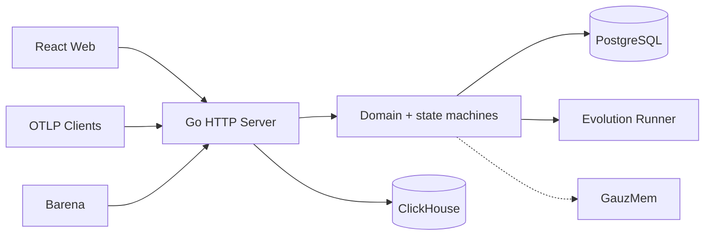
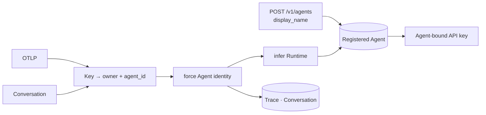

# Catena Control Plane Specification

Status: implemented MVP1 contract
Updated: 2026-08-07

## Responsibilities

The Go server owns public product state and transport:

- OAuth/session, Agent registration and Agent-bound API-key authentication;
- owner-scoped projects and requests;
- OTLP/HTTP ingestion and ClickHouse Trace reads;
- XiaoBaOS Conversation ingestion and PostgreSQL reads;
- canonical Agent resolution without rewriting original telemetry identity;
- immutable Agent Trace Sets and Evolution Job state;
- versioned Evidence Pack delivery to the private Runner;
- Candidate provenance and audit;
- same-origin React static asset serving;
- private GauzMem gateway.

It does not implement model reasoning, execute the target Agent, calculate Barena verifier results or let workers write product databases directly.

## Current Architecture

## Target Architecture

Existing tokens with no `agent_id` remain a bounded compatibility path. Every
new token is created atomically with an Agent and cannot change its binding.
The durable worker queue remains the next control-plane reliability milestone.

## Data ownership

- PostgreSQL: identity, credentials, Conversations, Runs, Jobs, Candidates and audit.
- PostgreSQL Registered Agent owns display name, inferred Runtime and key
  binding; payload metadata cannot mutate its stable identity.
- ClickHouse: raw Trace, Span and event evidence.
- Runner filesystem: temporary workspaces only.
- GauzMem stores: optional memory facts and indexes behind the private gateway.

## Invariants

- Every mutation is owner-scoped and validates source ownership.
- New API keys are bound to one Agent; direct ingestion overwrites incoming
  Agent identity from that binding.
- Idempotency keys return the original logical result.
- Agent Trace Set membership is frozen before worker execution.
- Stage events move state forward only; terminal state cannot be overwritten by stale events.
- Candidate provenance contains the exact Evidence Pack and Trace IDs.
- OAuth state/PKCE, API-key hashing and token recovery remain fail-closed.
- Cloud synchronization failure never changes a local Barena decision.

## Public contracts

- `POST /v1/agents`: atomically create Registered Agent and its initial key.
- `GET /v1/agents`: registered Agents merged with evidence metrics.
- `/v1/otlp/v1/traces`: Agent-key-authenticated OTLP/HTTP ingestion.
- `/v1/ingest/conversations`: `xiaoba.conversation_batch.v1`.
- `/v1/ingest/run-bundles`: idempotent `barena.run_bundle.v1`.
- `/v1/evolution-jobs`: Agent Trace Set creation, listing and detail.
- `/v1/memories`: private-backend memory operations through owner-derived scope.

Compatibility attribute aliases may be accepted during OTLP normalization, but they do not define Catena's architecture.
