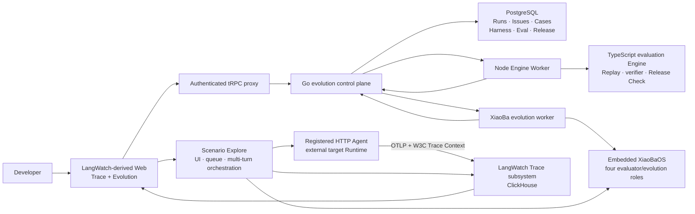
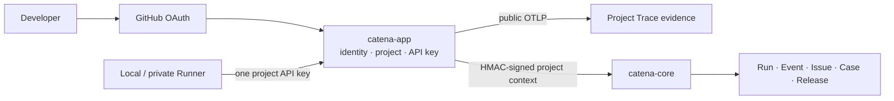

# Catena Control Plane Specification

Updated 2026-08-01.

## Purpose

The Catena control plane is the durable workflow and evidence ledger for Agent
Runtimes. Catena as a whole
turns real usage evidence and active Explore findings into reviewed Issues,
reproducible Cases, evaluations, and auditable releases. It is not a generic
trace viewer or a second deterministic evaluation Engine. It embeds a
restricted XiaoBaOS evaluator/evolution Runtime, but never hosts the user's
target Agent Runtime.

XiaoBaOS is the first-party reference integration; OpenClaw, Claude Code, Codex,
Hermes, and other Runtimes use the same OTel, Runtime Adapter, and Case
contracts. The target Agent Runtime always remains external; Barena's embedded
XiaoBaOS is a separate cloud worker for UserCat, InspectorCat, ReviewerCat, and
EvolutionCat only. Barena has two
honest execution modes: the Platform runs Explore directly against a registered
public HTTP Agent endpoint, while the CLI runs beside local or private Runtimes.
Both modes feed the same multi-user evidence and evolution flywheel.

The first product loop is:

`Session/Explore -> Trace -> Issue -> reviewed Case -> Replay -> Release`

Replay and Compare remain Engine capabilities, but do not compete with Explore
and observation in the primary Web navigation.

## MVP1 Product Contract

MVP1 is a locally deployable, single-project proof that the complete evolution
loop works. XiaoBaOS is the only first-party Runtime required for acceptance;
the deterministic XiaoBaOS fixture is the repeatable test target and one
installed local XiaoBaOS Role is the optional live smoke target.

One developer can:

1. select a registered HTTP Agent, describe one behavior, and start a real
   multi-turn Explore from the LangWatch-derived Web;
2. watch XiaoBaOS UserCat, the target conversation, trace-aware ReviewerCat, and
   correlated OTLP evidence reach a terminal state;
3. adopt that completed run as canonical Barena evidence, create an
   evidence-backed Issue, and explicitly promote it to one immutable
   Case with a replay prompt and deterministic artifact verifier;
4. start Replay for a replay-capable Case through the existing Engine Worker;
5. compare two compatible completed Explore runs as factual, side-by-side
   evidence without manufacturing a release verdict;
6. see the persisted `cleared`, `held`, or `rejected` Release Gate decision
   together with Case, Run, Harness, and source-Trace lineage.

MVP1 may use loopback deployment and the existing local worker. It does not
require a cloud scheduler, endpoint tunnel, Go Runner, community, automatic
mutation, arbitrary authenticated HTTP replay, multi-Runtime parity, or
production tenancy migration.
The browser still enters through the LangWatch fork: its server proxies
project-scoped Barena workflow calls to Go rather than exposing a second
browser-to-Go product API.

## Current Architecture

The repository and the Apache-2.0
[`fightheyyy/CATENA`](https://github.com/fightheyyy/CATENA)
fork now form one working single-machine vertical slice. The LangWatch-derived
browser owns Trace observation and the Evolution workflow. Its authenticated
tRPC server proxies Barena business calls to Go. Go persists evolution state in
PostgreSQL and starts the existing Node Engine Worker for compatibility-mode
Replay. The Worker delegates all evaluation semantics to the TypeScript Engine.



MVP1 proves the loop with a deterministic XiaoBaOS fixture and PostgreSQL:
Explore evidence is ingested as genuine OTLP/protobuf, its Trace action creates
an Issue prefilled with the correlated `barena.run.id`, human review freezes one
immutable Case, Replay runs through the canonical Engine Worker, and the Web
shows the persisted Evaluation and Release Gate with source/replay lineage.

The custom embedded React client remains only as compatibility scaffolding. It
is not the MVP1 product surface.

## Target Architecture

Catena is a developer console with one restricted, embedded
evaluator/evolution Agent Runtime. It is not a general-purpose hosted target
Runtime. The
LangWatch fork supplies authentication/projects, registered HTTP Agents, the
Scenario execution runtime, OTLP/Trace storage, search, waterfall, and the Web
shell. A Platform Explore reuses Scenario's UI, run data, multi-turn
orchestration, HTTP target adapter, trace correlation, and result contract. In
Catena mode the User Simulator and trace-aware Judge are thin adapters over the
embedded XiaoBaOS `user-cat` and `reviewer-cat` roles; the Agent itself executes
at the registered external endpoint. A completed Scenario run is adopted into
Barena rather than executed a second time.

The Go service owns continuous-evolution records and orchestration: adopted Run, Issue, immutable
Case, Harness Version, Evaluation, and Release. The TypeScript Engine owns
deterministic Replay, local/private Runtime adapters, artifact verification,
scorecard facts, and Release Check. A dedicated XiaoBaOS worker reuses the
ordinary XiaoBa agent loop and may invoke exactly four roles. The cloud never opens a persistent tunnel
into a developer laptop: local/private execution remains a CLI responsibility.

```mermaid
flowchart LR
    Dev["Agent developer"] --> Explore["Explore<br/>describe one behavior"]
    Explore --> Scenario["Scenario runtime<br/>UI · orchestration · result"]
    Scenario --> Roles["XiaoBaOS evaluator roles<br/>UserCat · ReviewerCat"]
    Scenario --> HTTP["Registered HTTP Agent<br/>external Runtime"]
    HTTP -- "W3C context + OTLP" --> Trace["Evidence<br/>conversation · Trace · Judge facts"]
    Scenario --> Trace
    Trace --> EvolutionRuntime["Embedded XiaoBaOS<br/>evaluator/evolution Runtime"]
    EvolutionRuntime --> Roles["UserCat · InspectorCat<br/>ReviewerCat · EvolutionCat"]
    Trace --> Adopt["Adopt completed run<br/>Go control plane"]
    Adopt --> Issue["Issue"]
    Roles --> Issue
    Issue --> Case["Immutable Case"]
    Case --> Replay["Deterministic Replay<br/>TypeScript Engine"]
    Replay --> Gate["Release Gate"]
    Roles --> Gate
    Adopt --> Compare["Compare<br/>compatible run facts"]

    CLI["Barena CLI<br/>local / private Runtime"] --> Adapter["AgentRuntimeAdapter"]
    Adapter --> Local["XiaoBaOS · OpenClaw · Claude Code<br/>Codex · Hermes"]
    Local -- "OTLP + Run events" --> Trace

    classDef source fill:#eff6ff,stroke:#2563eb,color:#172554;
    classDef observe fill:#ecfdf5,stroke:#16a34a,color:#064e3b;
    classDef control fill:#fff7ed,stroke:#ea580c,color:#7c2d12;
    classDef evaluate fill:#f5f3ff,stroke:#7c3aed,color:#4c1d95;
    classDef release fill:#fdf2f8,stroke:#db2777,color:#831843;
    class Explore,Session source;
    class Trace observe;
    class Issue,Case control;
    class Verify evaluate;
    class Gate,Version release;
```



The fork authenticates both browser and Runner requests, then forwards
project-scoped Run/Event calls to Go over an internal signed contract. The
existing local worker path and custom React client remain migration scaffolds
until the Release Workbench reaches feature parity; neither is a second target
product.

## Final Source of Truth

| Component | Owns | Must not own |
| --- | --- | --- |
| TypeScript Evaluation Engine | Local/private Runtime adapters and execution; deterministic Replay; artifact verifier; scorecard facts; Release Check algorithm; immutable Run Package; embedded XiaoBaOS worker contract | Public auth, multi-user persistence, cloud Trace store, public HTTP Agent secrets |
| LangWatch-derived Catena Web + Scenario runtime | Product navigation; login, organization/project membership and keys; registered HTTP Agent Explore; Scenario CRUD, orchestration, HTTP target calls, live run and Trace views | Evaluator model execution, running local/private Runtimes, deterministic Replay verifier, release computation |
| LangWatch Trace subsystem | OTLP ingest, raw Trace storage/index/query, spans/events/tool-call presentation | Issue/Case lineage, artifacts, Harness Versions, scorecards, releases |
| Embedded XiaoBaOS evaluator/evolution Runtime | Execute only UserCat, InspectorCat, ReviewerCat, and EvolutionCat through the shared XiaoBa agent loop; UserCat and ReviewerCat serve Scenario Explore, while InspectorCat, EvolutionCat, and ReviewerCat serve post-Trace evolution | Scenario UI/orchestration, target Agent serving, deterministic verifier, release authority, code/runtime/tool mutation |
| Go continuous-evolution control plane | Project-scoped adopted Run/Event state, Issues, Case review/promotion, Harness Versions, Run Package integrity, evaluation/release records, audit, Run-to-Trace index, and embedded Runtime lifecycle | Raw OTLP/Trace storage, model reasoning, Judge/verifier semantics, Compare or Release Check computation |

This division is normative. “Go owns decision records” means it validates,
persists, and audits the decision produced by the TypeScript Engine; it does not
re-run the decision policy.

## V1 Flywheel

1. Platform Scenario executes a registered HTTP Agent Explore, or the CLI
   executes a local/private Runtime; the target exports OTLP and both paths
   retain Harness context.
2. The Platform adopts a completed Scenario run without re-executing it. A
   human or Inspector creates an Issue candidate from the retained Run/Trace.
3. Go rejects source Trace IDs that are not correlated to that Run.
4. Human review promotes the Issue into immutable Case revision 1 with replay
   input, Runtime/Harness context, success criteria, and verifier requirements.
5. The TypeScript Engine executes the Case through Replay and emits ordered
   Events plus `barena.run_package.v1`.
6. Go validates and persists the Engine result against the Case and Harness
   Version; LangWatch retains raw Trace evidence.
7. A Release references those immutable evaluation records and an explicit
   `cleared`, `held`, or `rejected` Engine decision.

The fork's identity/configuration PostgreSQL data and ClickHouse Trace data are
separate from the Barena evolution-domain schema. They may share physical
infrastructure, but no service may use cross-service joins, foreign keys, or
direct table reads.

### Issue and Case contract

An Issue is mutable review state over immutable evidence references:

```text
issue_id
source_run_id
source_trace_id?
title
summary
severity
status = open | promoted | dismissed
```

A promoted Case revision is immutable:

```text
case_id
revision = 1
source_issue_id
source_run_id
source_trace_id?
operation
input
runtime / harness context
success_criteria
verifier
```

Promotion is idempotent. The same Issue cannot create two Case revisions.
Promotion fails closed when the source Run is missing, belongs to another
owner/project, or the supplied Trace ID is not present in that Run's retained
Engine Events.

## Product Surfaces

- **Explore** selects or connects an HTTP Agent, describes one behavior, starts
  a Scenario run, and shows the simulated conversation, Judge, and live Trace.
- **Evidence** searches retained OTLP Traces and opens their span waterfall.
- **Evolution / Issues** is the evidence-backed review inbox for discovered
  failures and boundaries.
- **Evolution / Cases** contains reviewed immutable regression assets.
- **Evolution / Replay** runs supported Cases through the deterministic Engine.
- **Evolution / Compare** shows compatible completed-run facts side by side; it
  is explicitly not a Release Gate.
- **Evolution / Release Gates** answers whether a verified Harness Version may
  ship.
- **Integrations** configures HTTP Agents, endpoint Runner, OTLP, and CI.

Community profiles and public capability cards are retained as experimental
code, but are not part of the v1 primary journey.

## Contracts and Boundaries

- Platform HTTP Explore uses the existing Apache-2.0 Scenario runtime. Its
  User Simulator and Judge result are source execution facts, not a Barena
  Release decision. Local/private Explore remains in the TypeScript Engine.
- The TypeScript Engine remains the only implementation of deterministic
  Replay, artifact verification, scorecard computation, and Release Check.
- The Barena Platform fork owns login, organizations/projects, membership,
  public API keys, OTLP ingestion, Trace storage/search, and the Web shell.
- The Go service owns Run/Event persistence, Issue review, Case promotion,
  Harness Version lineage, immutable Run Packages, scorecard/release records,
  live delivery, cancellation state, audit, and Trace correlation. It validates
  records produced by the Engine and never computes a second verdict.
- Browser and Runner traffic enters through the fork. The gateway validates the
  existing project identity and forwards signed project context to Go; Go is
  not directly exposed as a second public authentication surface. Go stores
  neither OAuth credentials nor public project API keys.
- Run Events use the existing ordered `barena.engine_event.v1` contract.
  Duplicate Events are idempotent and sequence gaps fail closed.
- Agent-native telemetry uses OTLP and W3C Trace Context. Barena does not
  invent another span protocol.
- The Web reads owner-scoped REST/SSE contracts. Raw Trace, prompts, events,
  artifacts, and workspace paths remain private.
- The fork preserves LangWatch's authentication security contract and
  project-level API-key boundary. Barena does not add a second GitHub OAuth
  implementation to the target architecture.
- Loopback local mode remains available for development. Production ingress
  terminates HTTPS before the fork; the internal Go API is network-restricted
  and verifies gateway signatures.
- The pinned fork is the selected Trace substrate. Community code outside
  `langwatch/ee/` is Apache-2.0 at the fork point; attribution and enterprise
  carve-outs are preserved. Barena-specific patches stay small enough for
  regular upstream merges.
- The custom React workbench and per-Run Trace viewer are removed after
  LangWatch-derived Sessions/Issues/Cases/Evaluations/Releases parity. The
  TypeScript Engine and Go continuous-evolution control plane are retained.

## Explicitly Out of Scope for V1

- Reimplementing LangWatch OTLP ingestion, Trace storage, search, login, or
  project membership in Go.
- Moving User Simulator, Judge, verifier, Compare, or Release Check algorithms
  into Go or reimplementing Scenario in Barena.
- A cloud scheduler, job lease, heartbeat manager, persistent tunnel into a
  developer laptop, or Go Runner.
- Direct browser-to-Go access, a second endpoint credential, or shared
  cross-service database queries.
- Hosting XiaoBaOS or another target Runtime inside the Platform. A registered
  HTTP endpoint is invoked over its public contract; local/private targets stay
  beside the CLI.
- Persisting HTTP Agent credentials, authorization headers, or arbitrary body
  templates in Barena Case records. MVP1 Replay supports only the explicit
  no-secret standard HTTP contract and fails closed otherwise.
- Automatic prompt/code mutation or autonomous release. The v1 flywheel
  discovers, curates, verifies, and gates; a human accepts Cases and releases.

## MVP1 Acceptance

- [x] A genuine XiaoBaOS Explore Trace is searchable and renders nine
      correlated spans across User Simulator, registered HTTP Agent, native
      target, and trace-aware Judge.
- [x] The Trace action opens a prefilled Issue review without copying or
      fabricating Trace content.
- [x] Human promotion creates exactly one immutable `barena.case.v1` revision
      with replay prompt, success criteria, artifact verifier, Runtime context,
      source Run, and source Trace.
- [x] Replay executes through the existing Node Worker and TypeScript Engine;
      Go does not implement a second evaluator or Judge.
- [x] Go persists one Harness Version, Evaluation, and Release record from the
      hash-verified Run Package and Engine terminal fact.
- [x] The LangWatch-derived Evolution page shows Replay progress, Engine result,
      `cleared / held / rejected`, and source/replay Trace lineage.
- [x] PostgreSQL integration, TypeScript build/tests, Go race/vet, LangWatch
      typecheck/build, and browser acceptance pass.

## Platform Explore Slice Acceptance

- [x] A developer selects a registered HTTP Agent and completes a real
      multi-turn Scenario Explore from the browser.
- [x] The terminal run exposes its source result, conversation, Judge facts,
      and retained target Trace ID; adoption is idempotent and tenant-scoped.
- [x] Adoption creates no Evaluation or Release decision and stores no Agent
      secret; it only creates a canonical completed Explore Run and evidence.
- [x] The adopted Run can become an Issue and immutable Case. A safe standard
      HTTP Case can Replay to a deterministic verifier-backed Release Gate;
      unsupported HTTP configurations fail closed.
- [ ] Compare accepts only compatible completed runs and presents source facts
      side by side with an explicit non-decision label.
- [x] A XiaoBaOS-compatible HTTP fixture completes the browser
      flow; focused tests, type checks, production build, and diff checks pass.

## Post-MVP V1 Acceptance

The following remain intentionally outside MVP1 and must not be implied by the
local demo:

- retire the legacy loopback owner compatibility surface now that fork-originated
  workflow traffic uses signed project context;
- use one fork-issued project key for both remote Run/Event ingress and OTLP;
- add endpoint-push execution without a persistent cloud-to-laptop tunnel;
- automate OTLP forwarding from compatibility-mode per-Run capture into the
  selected Trace substrate;
- complete production tenancy, HTTPS/network isolation, and cross-project
  authorization tests;
- retire the embedded compatibility Web and Go-managed local Worker only after
  the fork reaches full execution parity.

## Catena Evolution Station Amendment (2026-08-02)

This amendment supersedes the earlier deferral of a Runner service and passive
post-Trace role workflow. The product is now named Catena; Barena remains its
evaluation/release engine.

MVP1 adds exactly one new aggregate: a project-isolated `EvolutionJob` sourced
from a terminal Run and retained Trace. Go orchestrates but does not implement
role reasoning. The restricted XiaoBaOS runtime runs InspectorCat,
EvolutionCat, and ReviewerCat in order; raw stage evidence and terminal failure
are retained. Display-ready output is a Finding, Case proposal,
`draft/unverified` Role/Skill/Memory/Harness Candidate, and proposal-only
Review. UserCat remains on active Explore.

The canonical Compose path separates execution into `catena-runner`; Go calls
it over a private internal protocol. The local child-process path is migration
compatibility only and must be removed once remote Runner cancellation,
ordered events, and failure behavior have parity. The target Agent remains
external. OTLP observes it; an HTTP endpoint or `AgentRuntimeAdapter` controls
it.

No automatic source modification, public Hub publication, Kubernetes,
multi-node scheduling, or claim that role output passed Release Gate is in
scope.

## Unified Identity and Ingress Amendment (2026-08-02)

The public identity and credential boundary is finalized at `catena-app`:



The endpoint-facing key is issued and revocable in the fork. It authenticates
both OTLP and `/api/barena/v1/ingest/*`. The fork resolves the key to a project,
enforces the API-key permission ceiling, and signs the exact internal request.
Go accepts that signed project principal for edge ingestion but never receives
or stores the public key. The historical Go `barena_pat_*` surface remains a
local compatibility path with an explicit removal target; it is not the
canonical Catena connection flow.
