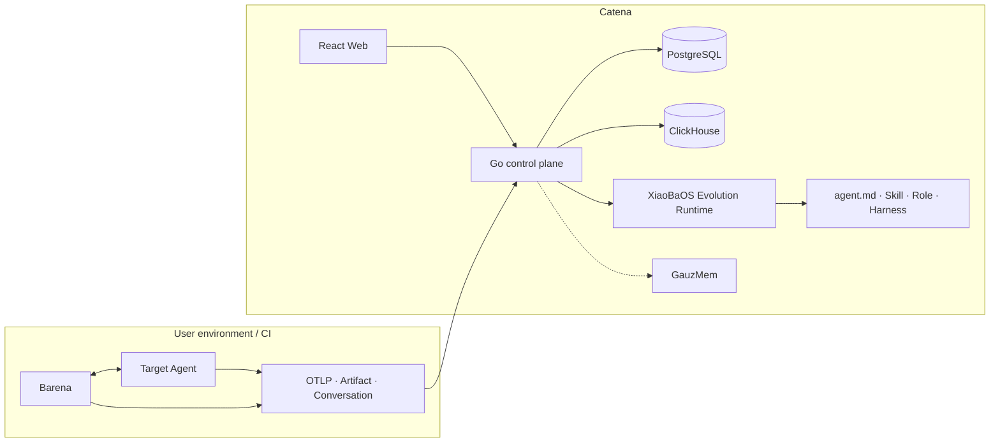

# Catena architecture

Catena is the cloud evidence and evolution platform; Barena is the local Agent E2E and release engine.

## Boundaries

| Component | Owns | Does not own |
| --- | --- | --- |
| React Web | interaction and visualization | auth truth, job state, database access |
| Go control plane | auth, API keys, OTLP, state, lineage and audit | target execution, model reasoning |
| XiaoBaOS Evolution Runtime | evidence analysis and Candidate generation | target Agent execution, release authority |
| Local Barena | Explore, Replay, Compare, Verifier and Release Check | cloud tenancy and long-term Trace history |
| GauzMem | memory compilation and recall | Agent identity and release decisions |

## Evidence loop

1. An external Agent exports OTLP and, for XiaoBaOS, user-visible Conversations.
2. Catena groups sources into a canonical Agent without rewriting raw identity.
3. A user selects an Agent and bounded time window.
4. Catena freezes the matching Trace IDs into an Evidence Pack.
5. Inspector, Evolution and Reviewer produce a provenance-linked Candidate.
6. The user may apply it and use local Barena Replay to verify behavior.

Evolution output remains a proposal. Catena does not apply it automatically or turn a Reviewer opinion into a release decision.

See [ADR 0003](./adr/0003-evolution-candidates-are-proposals.md).
