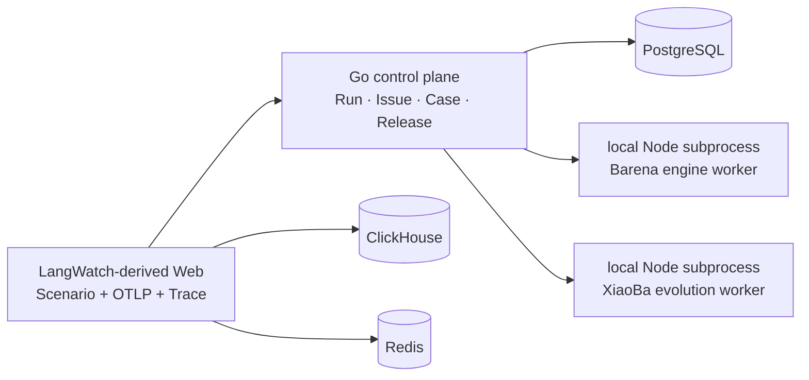
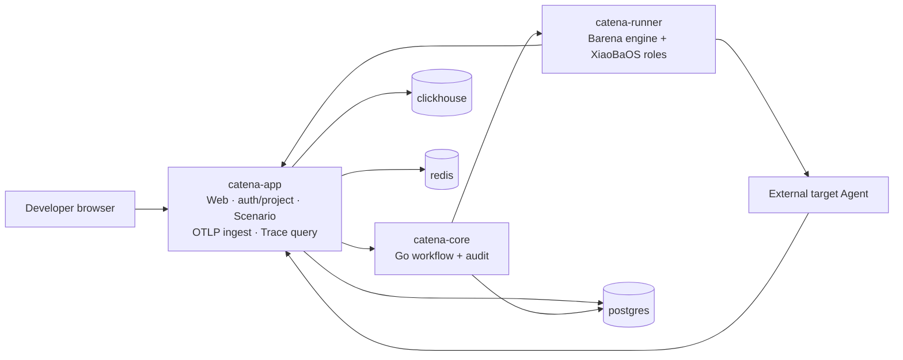

# Catena MVP1 architecture

Status: **locked for the 2026-08-02 demo**

Catena is an Agent continuous-evolution station. It observes real Agent
behavior, turns retained evidence into reviewable improvement assets, and uses
Barena to verify regressions and release decisions. Barena remains the Agent
E2E evaluation and release engine; it is not renamed to Catena.

The product promise for MVP1 is deliberately narrow:

> A developer can select one completed, OTLP-backed Explore run, start an
> auditable evolution job, inspect the XiaoBaOS role stages and their proposed
> Finding, replay Case, Candidate, and Review, then continue through Barena's
> existing Case -> Replay -> Evaluation -> Release Gate workflow.

## Product loop

```mermaid
flowchart LR
    Agent["External Agent Runtime<br/>XiaoBaOS · OpenClaw · Claude Code · others"]
    Explore["Explore<br/>Scenario User Simulator + Judge"]
    OTel["OTel / OTLP Trace<br/>real execution evidence"]
    Job["Evolution Job<br/>project isolated + auditable"]
    Inspect["InspectorCat<br/>find evidence-backed failure"]
    Evolve["EvolutionCat<br/>propose Case + Candidate"]
    Review["ReviewerCat<br/>review evidence and proposal"]
    Draft["Draft outputs<br/>Finding · Case proposal<br/>Role / Skill / Memory / Harness Candidate"]
    Replay["Barena Replay<br/>known-capability regression"]
    Gate["Release Gate<br/>cleared · held · rejected"]

    Explore --> Agent
    Agent -- "W3C context + OTLP" --> OTel
    Explore --> OTel
    OTel --> Job
    Job --> Inspect --> Evolve --> Review --> Draft
    Draft -- "human retains/promotes Case" --> Replay --> Gate
    Gate -- "new runtime behavior" --> Agent
```



The arrows are not one automatic mutation pipeline. A Candidate produced by an
evolution job is `draft/unverified`. It becomes release evidence only after an
explicit Case promotion and Barena execution. MVP1 neither edits a target
repository nor publishes to RoleHub/SkillHub.

## Current and target topology

### Current before MVP1



This topology already proves the Trace-to-Case-to-Replay loop, but the Go
process directly manages local Node subprocesses and there is no persisted
post-Trace evolution job.

### MVP1 demo target



The local demo has exactly six long-running containers:

| Container | Canonical responsibility |
| --- | --- |
| `catena-app` | LangWatch-derived Web, login/project boundary, registered HTTP Agent Scenario, OTLP receiver, Trace storage/query UI, and the signed server-side gateway to Go |
| `catena-core` | Go Run/EvolutionJob/Issue/Case/Harness/Evaluation/Release state machines, project isolation, idempotency, and audit |
| `catena-runner` | The only Compose execution plane for Barena Replay and the restricted XiaoBaOS evolution roles |
| `postgres` | Durable application and control-plane records in separate databases/schemas; no cross-database direct reads |
| `clickhouse` | Raw Trace/span/event storage and time-oriented queries |
| `redis` | LangWatch/Scenario queues, notification state, and cache; it is not Catena's source of truth |

`catena-app`, `catena-core`, and `catena-runner` are the three business
services. PostgreSQL, ClickHouse, and Redis are supporting infrastructure.
Compose is the MVP deployment contract. Kubernetes and Rainbond are deferred
until multi-node scheduling, rolling upgrades, or independent scaling is a
measured requirement.

## Evolution job contract

An Evolution Job starts from an existing terminal Run owned by the same
project. Its retained Trace ID and Run events are evidence references, not
prompt decoration. A repeated start with the same project, source Run, and
idempotency key returns the same job.

Canonical HTTP surface:

```text
POST /v1/runs/{run_id}/evolution-jobs
GET  /v1/evolution-jobs
GET  /v1/evolution-jobs/{job_id}
```

Canonical lifecycle:

```text
queued -> running.inspector -> running.evolution -> running.reviewer
       -> completed | failed
```

The ordered stage record retains status, timestamps, and raw role output. The
display-ready result contains:

- an evidence-backed `Finding`;
- a `CaseProposal` with replay input, expected behavior, and success criteria;
- one `Candidate` of kind `role | skill | memory | harness`, always
  `draft/unverified` in MVP1;
- a `Review` that assesses the proposal, not a Barena release decision.

UserCat remains on the active Explore path, where it simulates a user. Passive
analysis of an already-completed Run invokes InspectorCat, EvolutionCat, and
ReviewerCat only. The four-role XiaoBaOS runtime is still packaged together so
the same restricted runtime supports both active Explore and post-Trace
evolution.

## Source-of-truth and trust boundaries

| Plane | Owns | Does not own |
| --- | --- | --- |
| `catena-app` | browser auth, organizations/projects, registered endpoint secrets, Scenario/Judge facts, OTLP ingest, raw Trace query/presentation | Evolution/Case/Release state machines or release verdicts |
| `catena-core` | project-scoped workflow records, idempotency, lineage, audit, candidate review state | model execution, target Agent execution, raw Trace storage, release computation |
| `catena-runner` | Barena engine protocol, deterministic verifier/Release Check, restricted XiaoBa role turns | public login, durable product records, raw Trace database |
| External target Runtime | actual Agent behavior and native telemetry | evaluation verdicts |

OpenTelemetry is the common behavioral evidence schema and OTLP is its
transport. They do not control an Agent. Scenario's registered HTTP adapter or
Barena's `AgentRuntimeAdapter` performs execution. Artifacts, verifier outputs,
and immutable Case/Run Package hashes stay first-class evidence beside Trace.

Browser calls authenticate in `catena-app`. Its server signs exact method,
path, project, actor, timestamp, and body digest before calling
`catena-core`. Services communicate on the private Compose network. Secrets,
absolute host paths, and hidden reasoning are never stored as Trace evidence or
returned in evolution output.

## MVP1 acceptance

The demo is accepted only when all of the following are shown against running
services rather than static fixtures:

1. A real project can ingest or retain an OTLP-backed Explore Trace.
2. The Evolution page starts one idempotent job from a completed Run and makes
   its current stage obvious.
3. InspectorCat, EvolutionCat, and ReviewerCat stage evidence is retained and a
   Finding, Case proposal, draft Candidate, and Review are inspectable.
4. Existing Issue -> immutable Case -> Replay -> Evaluation -> Release Gate
   continues to work and remains the only path that may say
   `cleared | held | rejected`.
5. Cross-project access fails closed.
6. The six-container Compose stack reports healthy and the repository test,
   race, typecheck, build, API, and browser checks pass.

## Demo evidence — 2026-08-02

The accepted browser journey used retained project data rather than static UI
fixtures:

1. Trace Explorer opened an Explore trace containing nine spans across the
   User Simulator, external HTTP Agent, and trace-aware Judge.
2. A project-scoped Evolution Job completed the Inspector, Evolution, and
   Reviewer stages and persisted an evidence-backed Finding, replay Case
   proposal, `harness` Candidate, and proposal-only Review. The Candidate was
   displayed as `draft/unverified` and was not applied automatically.
3. A real immutable Case Replay executed two isolated attempts. Both artifact
   verifiers passed, 14 Barena-owned spans were exported, and the resulting
   Evaluation and Release records retained the decision `cleared` unchanged.
4. A browser-discovered query race that briefly displayed a terminal Replay as
   missing Evaluation evidence was fixed; terminal Run changes now invalidate
   Evaluation and Release queries together.
5. `npm run check` passed 178 TypeScript tests, `go test -race ./...` and
   `go vet ./...` passed, Platform type checks and production assets passed,
   and the final Compose smoke reported exactly six healthy services.

The Compose smoke validates deployment, service protocols, database/cache
health, and the embedded four-role Runtime probe without spending model quota.
The paid role-turn E2E was run separately against the host model proxy. MVP1
does not yet recover an in-flight Evolution Job after a `catena-core` process
restart; terminal records remain durable.

## Explicit non-goals

- public RoleHub/SkillHub publication;
- automatic modification of a target repository or live Agent;
- hosting every user's target Runtime inside Catena;
- Kubernetes, multi-node leases, autoscaling, and cloud-to-private tunnels;
- active execution adapters for every Runtime;
- presenting a Scenario Judge or XiaoBa Reviewer result as a Release Gate.

Architecture decisions are recorded in [`adr/`](./adr/).
