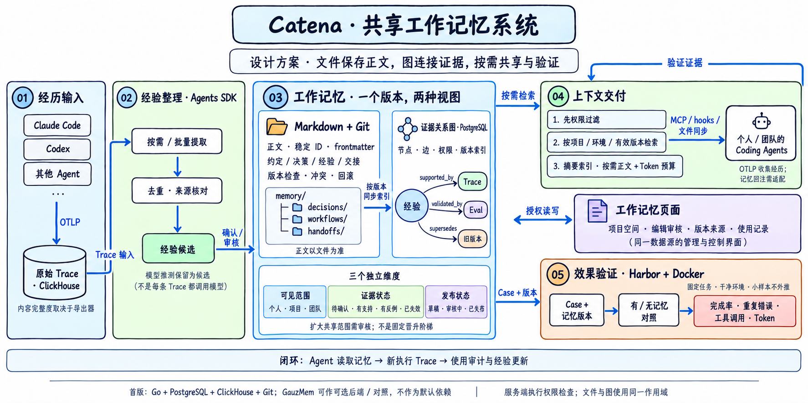

# 共享工作记忆架构图

使用内置 imagegen 生成，Excalidraw 风格；这是设计方案，不代表功能已实现。

## 准确的数据流

1. Coding Agent 经 OTLP 写入原始 Trace；按需/批量整理形成经验候选。
2. 确认后正文保存为 Markdown + Git；PostgreSQL 按相同版本建立关系索引、权限和审计。
3. 服务端先过滤授权，再按任务选取有效记忆，用 MCP/hooks/文件适配交付给 Agent。
4. 记忆页面通过同一服务端读取、编辑和审核，不另建记忆存储。
5. Harbor 对固定 Case 进行有/无记忆对照；验证证据最终回写记忆关系图。
6. 外部 Agent 后续执行产生新 Trace，关联记忆使用版本与结果。

图中右上「验证证据」连线落点不准确：应回到 03 证据关系图，而非 04 上下文交付。

## 生成提示词摘要

原始提示：中文 Catena 共享工作记忆系统，五区布局（经历输入、经验整理、工作记忆、上下文交付、效果验证）；
Markdown/Git 正文为准，PostgreSQL 为证据图与授权索引；三独立维度分别为可见范围、证据状态、发布状态；
不采用固定个人到团队晋升链；OTLP 输入与 MCP/hooks 输出分开；Harbor/Docker 验证；标明首版技术栈与设计状态。
后续提示：保持风格和内容，校正流程箭头，简化跨区域连线，增加文字闭环。
