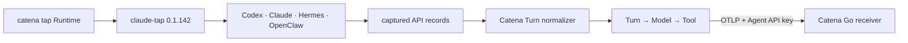
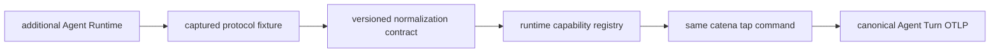

# Catena Tap Specification

Status: MVP implementation contract
Updated: 2026-08-11

## Problem

Agent runtimes expose different telemetry shapes. Native OTLP alone does not
consistently preserve a user turn as one Trace with its model calls, tool calls
and tool results. Catena Tap provides one local command that captures those
runtime-native model interactions and emits a canonical Agent Turn Trace to
Catena.

## Scope

Catena Tap owns:

- launching Codex, Codex App, Claude Code, Hermes or OpenClaw through the
  pinned `claude-tap` capture engine;
- rebuilding consecutive model requests into one Agent Turn;
- pairing tool calls with tool results for Anthropic Messages, OpenAI
  Responses and OpenAI Chat Completions shapes;
- exporting fail-open OTLP/HTTP JSON with the selected Agent API key.

It does not provide a second dashboard, retain cloud product state, execute
Barena evaluation workflows, or replace Runtime-native operational telemetry.
The first release captures new runs; historical transcript import is out of
scope.

## Current Architecture



## Target Architecture



## Public contract

```text
catena tap <codex|codexapp|claude|hermes|openclaw> [tap options] [-- runtime args]
```

Configuration:

- `CATENA_URL`: Catena origin; defaults to `http://127.0.0.1:5670`.
- `CATENA_API_KEY`: Agent-bound Catena API key.
- `CATENA_OTLP_ENDPOINT`: optional full OTLP Trace endpoint override.
- `CATENA_TAP_DEBUG`: print exporter diagnostics when truthy.

The normalizer emits one 128-bit Trace ID per completed user turn. Its root
span is `agent.turn`, each model request is `gen_ai.model.call`, and every
observed tool invocation is an `agent.tool.call` child span. Tool outputs and
errors are attributes on the matching tool span.

## Failure boundary

Trace capture and upload are fail-open: an unavailable Catena endpoint never
blocks or changes the target Agent result. Buffered incomplete turns are
flushed on normal process shutdown and marked `catena.turn.incomplete=true`.

## Upstream boundary

The capture engine is the pinned PyPI package `claude-tap==0.1.142`. Catena Tap
uses its public package modules and locally patches the TraceStore append hook
for the lifetime of the wrapper process. Catena does not ship claude-tap's
dashboard or fork its storage UI.
