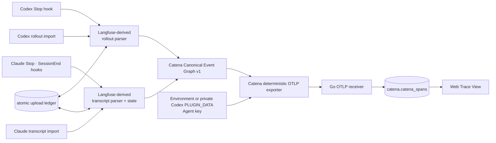
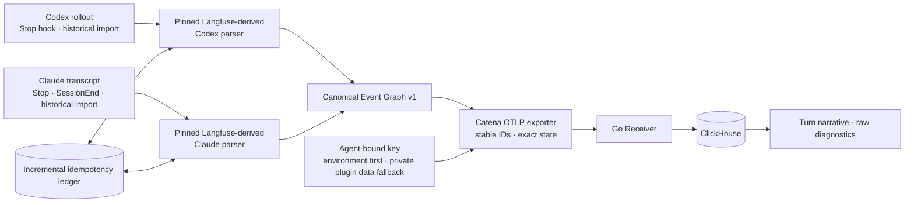

# Catena Tap Specification

Status: implemented Runtime parser contract
Updated: 2026-08-14

## Problem

Coding Agent runtimes persist authoritative local execution records, but their
rollout/transcript schemas differ. Catena turns those records into one
versioned Canonical Event Graph and then into deterministic OTLP without
proxying model traffic or guessing turn boundaries from Prompt text.

## Scope

The Runtime capture module owns:

- Codex Stop-hook and historical rollout parsing derived from Langfuse's
  `codex-observability-plugin`;
- Claude Code Stop/SessionEnd-hook and historical transcript parsing derived
  from Langfuse's `claude-observability-plugin`;
- the language-neutral `catena.coding_agent.event_graph.v1` contract;
- deterministic, fail-open OTLP/HTTP export with an Agent API key;
- atomic local upload state for incremental, resumable and idempotent hooks.

It does not proxy model HTTP traffic, use a Langfuse SDK/backend/API key,
provide a second dashboard, execute Barena workflows, or claim support for a
Runtime without a dedicated parser and real acceptance. Codex App, Hermes and
OpenClaw are explicitly unsupported.

## Current Architecture

The former `claude-tap → HTTP proxy record → TraceStore monkey patch →
TraceNormalizer` path has been deleted; it is not a compatibility or fallback
path.

## Target Architecture

This target is reached for the accepted Codex CLI and Claude Code versions.
Future Runtime support adds a dedicated parser to the same graph boundary; it
does not add a proxy, shared normalizer or Langfuse backend.

## Canonical Event Graph contract

- One graph contains the Runtime's original `session_id` and one or more
  original user turns. Codex uses session metadata plus
  `task_started.turn_id`; CLI `0.147.0` does not emit a W3C `trace_id`, so the
  transport Trace ID is a deterministic encoding of that native
  `session_id:turn_id` correlation. A future valid Runtime `trace_id` takes
  precedence and is preserved. Claude Code uses transcript `sessionId` plus
  the real user-row UUID and applies the same deterministic transport encoding
  because its transcript also exposes no W3C Trace ID. Capture sessions and
  Prompt fingerprints are forbidden.
- One turn root parents every model attempt, context-compaction event and
  subagent thread belonging to that turn. Each model attempt parents exactly
  the tool calls it requested. Subagent turns retain both their Runtime thread
  identity and spawning-tool parent.
- Function, custom, local-shell, Web Search, File Search, Computer and MCP
  tools retain type, name, input, output, status and exact Runtime call ID.
  Non-empty unknown result IDs remain unbound evidence and must never attach to
  another call. Missing IDs may be represented as unpaired evidence but are
  never matched by order.
- Turn, model and tool state is one of `ok`, `error`, `aborted`, `incomplete`
  or `retry`. Abort and failure always produce OTLP error status.
- Every Canonical node carries stable source-event references. Fixture audits
  require every retained Runtime record/block to resolve to exactly one
  Canonical Span or an explicit ignored-record disposition.
- Span and Trace IDs are stable functions of Runtime-provided identities, so a
  retrying hook replaces the same logical spans in ClickHouse.
- The Catena emitter identifies accepted parser output with the exact resource
  pairs `catena-runtime-codex` + `agent.runtime=codex` and
  `catena-runtime-claude-code` + `agent.runtime=claude-code`; the receiver does
  not infer support from product-name substrings.

## Runtime entry points

- Codex: the committed plugin Stop hook and `catena trace import codex` call
  the same rollout parser.
- Claude Code: the committed Stop/SessionEnd hooks and
  `catena trace import claude` call the same transcript parser.
- `CATENA_URL` defaults to `http://127.0.0.1:5570`;
  `CATENA_OTLP_ENDPOINT` may override the full endpoint;
  `CATENA_API_KEY` is the Agent-bound credential; `CATENA_TRACE_DEBUG` enables
  diagnostics. Codex resolves the key from the environment first and otherwise
  from `credentials.json` under its Runtime-provided `PLUGIN_DATA`; that file
  must be owner-only (`0600`). No Langfuse configuration is read.

## Failure boundary

Hook capture and upload are fail-open: parser, state or network failure never
changes the Runtime result. Hooks read only appended data where the upstream
implementation supports it, upload stable spans in bounded per-turn batches,
and atomically advance state only after a 2xx response. Stop may upload an
incomplete turn; SessionEnd finalizes what the transcript proves and marks the
rest incomplete. Repeated hooks are safe before or after any crash boundary.
Codex live synchronization is Turn-end incremental, not per-token streaming.
Codex writes `task_complete` after its synchronous Stop hook returns, so the
hook schedules a bounded detached settle pass. That pass invokes the same
parser after the row appears and replaces the provisional spans by stable ID;
if it cannot settle, the provisional evidence remains incomplete rather than
being reported as success.

## Upstream boundary

- Codex parser/turn assembly is derived from
  `langfuse/codex-observability-plugin` at commit
  `7500867afecf963d1cf83bf2b860a659591ace18`.
- Claude transcript parser, incremental state and turn assembly are derived
  from `langfuse/claude-observability-plugin` at commit
  `5b3d4323c49f3839545fad36883ed02420ebc0ba`.
- Both upstreams are MIT-licensed. Their license texts, exact source URLs,
  commits and Catena modification notes ship beside the derived sources.
- Langfuse emitters, SDK dependencies, configuration and API authentication are
  not reused. `claude-tap`, its proxy, viewer and TraceStore hook are removed.
